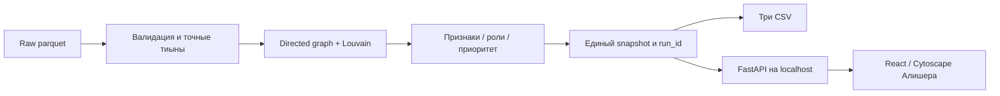

# Neverlose · Граф денег

Локальное рабочее место AML-аналитика для Finance / Freedom, HackAlem AI 2026. Из трёх исходных parquet система строит направленный граф, объяснимые гипотезы ролей, кластеры и очередь проверки. Любой gid связан с реальными переводами и ограничениями наблюдения. Результат не устанавливает виновность.

**Состояние реализации:** расчётное ядро, три CSV, API и CLI реализованы и проверены. UI разрабатывается Алишером в `codex/workspace-ui`; интеграция полного графа/переводов и финальная браузерная приёмка ещё не завершены. Подача на платформе не подтверждена. [Актуальный статус](docs/hackalem/STATUS.md), [проверки](docs/validation.md), [журнал A](docs/progress/A.md), [журнал B](docs/progress/B.md).

## Получение и установка

Официальный приватный репозиторий: [BAITC-Hacks/hack-1eeed6ff-s-ztech](https://github.com/BAITC-Hacks/hack-1eeed6ff-s-ztech). Для получения исходников нужен предоставленный организатором доступ; работа приложения не требует аккаунта участника.

```bash
git clone https://github.com/BAITC-Hacks/hack-1eeed6ff-s-ztech.git
cd hack-1eeed6ff-s-ztech
git switch codex/analysis-core
python3.12 -m venv .venv
source .venv/bin/activate
python -m pip install -r requirements.lock
python -m pip check
```

Проверено: Python 3.12.14, macOS 26.6.2 arm64, Apple M4, 16 GiB RAM. Для обычного запуска нужны Python 3.12, зависимости из lock, исходные parquet, свободный локальный порт. Целевой профиль 4 CPU / 8 GB RAM пока не измерен. Windows/Linux отдельно не проверены. На Windows эквивалент: `py -3.12 -m venv .venv`, затем `.venv\Scripts\python.exe -m pip install -r requirements.lock`; использовать этот интерпретатор для всех команд без активации.

Python-зависимости: pandas 2.2.3, NumPy 2.3.5, PyArrow 25.0.1, NetworkX 3.7, SciPy 1.18.1, FastAPI 0.141.1, Pydantic 2.13.5, Uvicorn 0.53.0. Транзитивные зависимости зафиксированы в [requirements.lock](requirements.lock). При запуске пакеты не устанавливаются автоматически.

## Запуск и остановка

Один пересчёт от raw до всех трёх CSV, без ручных промежуточных шагов:

```bash
python run.py --pipeline-only
```

Рабочий API для интеграции интерфейса:

```bash
python run.py --api-only
```

Сервер: [http://127.0.0.1:8000](http://127.0.0.1:8000), проверка готовности: `/health`, данные: `/api/v1/meta`. Остановка — Ctrl+C. В `--api-only` корневая страница честно сообщает об отсутствии подключённого UI.

Обычный запуск приложения после получения проверенного `web/dist` Алишера:

```bash
python run.py
```

Эта команда проверяет raw, пересчитывает результат, сохраняет CSV/snapshot и обслуживает локальную сборку интерфейса тем же процессом. Пока сборка отсутствует, команда выдаёт понятную ошибку; готовность полного UI пока не заявляется. На финальном commit `web/dist` должен быть включён, Node не нужен для просмотра жюри.

```bash
python run.py --verify-only
python run.py --pipeline-only --data data --out results
python run.py --api-only --port 8001
```

Все параметры:

| Параметр | Значение по умолчанию | Назначение |
|---|---|---|
| `--data` | `data` рядом с run.py | Три исходных parquet |
| `--out` | `results` рядом с run.py | Отдельный каталог результата |
| `--rules` | `config/rules.json` | Опубликованные формулы и пороги |
| `--profile` | `official` | Проверка точных hashes организатора; `generic` допускает иные графы с теми же схемой, периодом и порогом |
| `--host` | `127.0.0.1` | Только loopback: 127.0.0.1, localhost или ::1 |
| `--port` | `8000` | Свободный порт 1…65535 |
| `--pipeline-only` | выключен | Пересчёт и завершение |
| `--verify-only` | выключен | Проверка существующего результата, raw/config/hashes; центральности не пересчитываются |
| `--api-only` | выключен | Разработка API без web/dist |

Последние три режима взаимоисключающие. Для основного сценария переменные окружения, `.env`, API-ключи, платные сервисы, GPU и внешняя модель не требуются. Каталог вывода не может перекрывать raw или содержать посторонние файлы.

## Интерфейс и сборка

Ответственность Алишера: React 19 / TypeScript / Vite / Cytoscape, поиск, граф, карточки, браузерные проверки. Контракт принят B на `7266a72`; [контракт и оболочки](contracts/README.md), [synthetic fixture](contracts/v1.example.json), [настоящий ответ API](contracts/v1.actual.json). Fixture не является результатом и не используется в production fallback.

После интеграции `web/`, для пересборки нужен Node >=22.12 и npm:

```bash
cd web
npm ci
npm test -- --run
npm run build
npm run test:e2e
```

Не заменять `npm ci` обновлением до latest. Независимая проверка полной сборки на машине A и чистый запуск на машине B будут зафиксированы в [validation](docs/validation.md). Успешный build не заменяет браузерный сценарий.

## Данные и результаты

| Файл | Строк | Поля |
|---|---:|---|
| `data/nodes.parquet` | 2 248 | gid:int64, depth:int64, is_seed:bool |
| `data/edges.parquet` | 3 119 | src:int64, dst:int64, sum_kzt:float64, n_tx:int64, depth:int8 |
| `data/transactions.parquet` | 4 840 | src:int64, dst:int64, date:day, sum_kzt:float64 |

81 seed, июль 2026, порог 5 000 KZT, только внутрибанковские исходящие пути до четырёх колен. Сумма наблюдаемых переводов **365 890 012,01 KZT** — не объём уникальных денег. Hashes/схемы: [официальный manifest](docs/hackalem/sources/manifest.json), [выполненный loader audit](docs/hackalem/evidence/a1-loader.json).

97 повторяющихся транзакций сохраняются: банковского ID нет, исходные агрегаты учитывают все строки. 19 изолированных seed остаются в графе, отдельных кластерах и выгрузках. Всего 35 слабых компонент со всеми узлами.

```text
results/nodes_roles.csv  gid,role,role_score,cluster_id,priority_score,evidence
results/clusters.csv     cluster_id,n_nodes,n_seed,sum_kzt_internal,top_gids,hypothesis
results/top_nodes.csv    rank,gid,role,priority_score,why
results/snapshot.json    Полные признаки, правила, переводы, ограничения, config и run_id
results/manifest.json    Hashes входов/выходов, версии, размеры и длительность
```

CSV — UTF-8, точные десятичные gid, score с 6 знаками. Evidence непустой и не длиннее 200 Unicode-символов. `top_gids` в CSV разделены `;`, в JSON это массив строк. Все исходные узлы присутствуют ровно один раз. Топ — первые min(50,N); на официальных данных 50. Ранжирование использует полный score до округления и затем меньший gid.

Фактический первый расчёт: 89 кластеров; consolidator 113, distributor 102, coordinator 8, transit 63, peripheral 884, terminal 1078. Это результат опубликованных эвристик v1, а не разметка истинных ролей.

## Алгоритмы и объяснимость

Подробные формулы: [02_DATA_ALGORITHMS.md](docs/hackalem/02_DATA_ALGORITHMS.md). Действующие параметры: [config/rules.json](config/rules.json), версия `v1`.

Деньги проверяются на точность до тиына: `abs(100*x-round(100*x))<=1e-6`. После проверки все суммы агрегируются целыми Python int. Пары/число операций/суммы tx сверяются с edges; допустимое различие до 1 тиына фиксируется, каноническая сумма берётся из tx. Неизвестный endpoint, null, inf, self-loop, неверный период, тип или точность останавливают расчёт.

Граф включает все nodes. PageRank: alpha=.85, tol=1e-8, max_iter=500, денежный вес. Betweenness: directed, normalized, **без весов расстояния**, выборка k=min(128,N), seed=42. Seed-reach — число разных seed с направленным путём длиной 1…4, исключая сам seed. Louvain: неориентированная проекция со **суммой обоих направлений**, resolution=1, threshold=1e-7, seed=42. Несвязные части сообществ разделяются; изоляты — singleton. ID кластеров: размер desc, минимальный gid asc.

Обозначения: I/O — наблюдаемый вход/выход, a/b — число разных отправителей/получателей, s — seed-reach, r=O/I при I>0, C — разнообразие кластеров соседей по обороту, B — betweenness. `P(x)` — ранг среди положительных значений, ties включаются полностью, для нуля P=0. `clip` ограничивает 0…1.

| Роль | Условие | Raw score |
|---|---|---|
| consolidator | a≥3 | .45·clip(a/8)+.25·P(I)+.30·clip(s/3) |
| distributor | b≥5 | .60·clip(b/20)+.40·P(O) |
| transit | не seed/boundary, a,b≥1, I>0, .8≤r≤1.2 | .60·clip(1−abs(1−r)/.2)+.20·clip(min(a,b)/3)+.20·P(min(I,O)) |
| terminal | не seed, depth<4, a≥1, b=0, I>0 | .50+.25·P(I)+.25·clip(a/3) |
| coordinator | depth<4, a,b≥2, s≥2, C≥.30, P(B)≥.90 | .35·P(B)+.25·C+.20·clip(s/5)+.20·P(PageRank) |
| peripheral | нет допустимого кандидата / изолят | .20 / 0 |

Выбор по наибольшему raw score. Ties: coordinator → consolidator → distributor → transit → terminal. Затем применяются caps: coordinator .55; terminal/boundary/seed .65; одна операция или меньше .45. Это консервативные соглашения, не статистическая калибровка. Все кандидаты, условия pass/fail, raw/capped score и действующие caps доступны в карточке API. Альтернатива — следующая допустимая роль, иначе null с объяснением недостаточности данных.

Приоритет: `.30·P(I+O)+.25·P(B)+.20·clip(s/5)+.15·max(P(a),P(b))+.10·C`. Для изолята ноль. Пять вкладов публикуются отдельно; сумма сверяется с итогом до 1e-12. Seed не даёт прямого бонуса, низкий role_score не скрывает важный узел.

Перевод имеет `source_ref=tx:<12 символов SHA-256>:<source_row>`; source_row — 0-based физическая строка parquet, не банковский transaction_id. Совпадающие платежи имеют разные ссылки. Переводы сортируются по date, затем source_row. Суммы API transfers относятся ко всей выбранной direction, а не текущей странице. Краткая Markdown-справка доступна в `/api/v1/nodes/{gid}/brief`.

## Архитектура



`run_id` — SHA-256 от source hashes, полного config, algorithm_version и точных версий вычислительных библиотек. Время записывается отдельно. GET не запускает пересчёт. API держит snapshot и байты CSV в памяти одного запуска, поэтому параллельный последующий CLI-пересчёт не смешивает данные сервера.

Новый результат готовится в соседнем временном каталоге и проверяется до активации. Замена каталога имеет rollback при ошибке переименования; это не универсальная атомарная замена директорий при аварийном выключении ОС. Один output защищён lock-файлом от двух писателей. Исходные данные не изменяются. БД и внешние сервисы отсутствуют.

| Каталог | Назначение |
|---|---|
| `app/` | loader, graph/features, clusters, roles, ranking, explanations, pipeline, schemas, API |
| `config/` | Версионированные пороги и веса |
| `tests/` | Искусственные графы, raw-инварианты, API/CSV и отказоустойчивость |
| `contracts/` | Договор A/B, synthetic и реальные примеры |
| `data/`, `starter/` | Оригинальные материалы организатора, без изменений |
| `results/` | Генерируемый проверяемый результат |
| `web/` | Зона Алишера; добавляется интеграцией его ветки |
| `docs/hackalem/`, `docs/progress/` | ТЗ, источники, критерии, фактическая история |

API: `/api/v1/meta`, `/nodes`, `/nodes/{gid}`, `/nodes/{gid}/transfers`, `/graph`, `/clusters`, `/clusters/{id}`, `/exports/{name}`, `/nodes/{gid}/brief`. Оболочки/фильтры/ошибки описаны в [contracts/README.md](contracts/README.md), схема OpenAPI доступна локально в `/openapi.json`. Gid/src/dst — строки; денежные поля `*_kzt` — строки с двумя знаками. Пагинация 1…200, граф 1…1000 вершин; укороченный граф сообщает matched/shown counts.

## Проверка результата

```bash
python -m pip install -r requirements-dev.lock
python -m pytest tests -q
python -m ruff check app tests run.py
python -m compileall -q app run.py
python run.py --pipeline-only
python run.py --verify-only
```

Проверены соседние 18-значные gid, все исходные узлы, денежные агрегаты, дубли, self-loop/ошибки, boundary, seed, нулевой вход, шесть ролей, caps/ties, кластеры, приоритет, повторный и перемешанный вход, raw↔CSV, API-пагинация и ограничения графа. Актуальные числа тестов и ограничения проверки — [docs/validation.md](docs/validation.md).

После готовности полного UI независимый эксперт должен выполнить:

1. Открыть локальное рабочее место, сверить counts/period/run_id с `/api/v1/meta`.
2. Выбрать любой узел очереди, сверить gid/роль/score с `nodes_roles.csv`.
3. Проверить исходные переводы и сумму всей выборки; открыть следующую страницу.
4. Ввести любой полный gid из `data/nodes.parquet`, независимо от фильтров очереди.
5. Открыть boundary и изолированный seed; проверить предупреждения и отсутствие ложного terminal.
6. Проверить кластер, кандидатов/альтернативу, следующий запрос данных и скачать три CSV.
7. После установки отключить сеть и повторить основной сценарий.

Эта последовательность — приёмка; завершённой она считается только после записи фактического браузерного прогона. Независимый новый clone на втором ноутбуке ещё ожидается.

## Производительность и offline

На Apple M4 / 16 GiB / macOS 26.6.2 полный Python-вызов raw→CSV с проверкой занял 0,808 с; CLI `--pipeline-only` — 0,883 с (импорты/установка пакетов вне этого таймера). Первый HTTP smoke: карточка 2,398 мс, ego 2,185 мс локально; это единичные измерения, не нагрузочный SLA. 2 248/3 119/4 840 входных строк; 2 248/89/50 строк в трёх CSV.

Сеть нужна для первоначального получения исходников и пакетов. Runtime ядра/API не вызывает внешние сервисы. Полная offline-проверка после интеграции UI ещё ожидается. Универсальная установка без сети на неизвестной ОС не обещается: для неё нужен заранее проверенный wheelhouse для конкретной платформы. Личные .venv/.env не являются частью результата.

## Ограничения выводов

- 444 depth=4/out=0 — граница выгрузки; ни один не получает terminal только из-за отсутствующего выхода.
- Входящие и начальные остатки неполны. 354 узла имеют O>I при I>0, ещё 23 — нулевой вход при положительном выходе. Это не доказательство аномалии баланса.
- Конец наблюдаемого маршрута до depth=4 также не доказывает удержание денег. Координация — структурная гипотеза.
- Нет ФИО, ИИН, атрибутов клиента, других банков, точного времени суток и ground truth. Внешнее обогащение и вымышленные личности не используются.
- Louvain/центральности и пороги — эвристики. Число кластеров не подгоняется под замечания постановщика; accuracy/F1 не заявляются.
- Главный сценарий локальный, loopback-only, без банковской авторизации. Публичный production deployment не реализован.
- E1/E2 и LLM-агент пока не включены. Шаблонные объяснения честно обозначены детерминированными; за LLM-агента они не выдаются.

## Масштабирование до миллиона узлов

Текущая реализация проверена только на предоставленном объёме. Для ~1 млн узлов нужны колоночное/порционное чтение parquet, компактный графовый движок и adjacency, пересмотр стоимости Louvain/центральностей, предрасчёт ограниченных соседств и агрегаций, offline-расчёт дорогих метрик. UI должен получать ограниченные срезы и уровни детализации, а не весь граф. Сначала профиль памяти/времени, затем выбор распределённой инфраструктуры; это направление развития, не реализованный benchmark.

## Устранение ошибок

| Симптом | Действие |
|---|---|
| Нет Python 3.12 | Проверить `python --version`; создать .venv именно интерпретатором 3.12 |
| ModuleNotFoundError | Активировать .venv, выполнить установку из lock и `python -m pip check` |
| Ошибка precision/aggregate/hash | Не ремонтировать суммы вручную; повторно получить оригинальные файлы и сверить source manifest |
| Нет web/dist | Получить интегрированный commit или выполнить `npm ci` / `npm run build` в web |
| Порт занят | Остановить свой предыдущий сервер Ctrl+C или использовать `--port 8001` |
| Gid округляется в Excel | Импортировать колонку как текст; CSV сохраняет точные цифры |
| Узел не найден | Использовать полный gid; поиск относится ко всему набору, фильтры очереди не меняют данные |
| Pipeline lock | Убедиться, что другой пересчёт не выполняется; только затем удалить указанный в ошибке stale lock |
| Нет сети после install | Использовать установленные зависимости; не требуется API-key или облачный сервис |

Не скрываем повреждение данных заменой на fixture. При ошибке предыдущий успешный output сохраняется, но новый запуск не объявляется успешным.

## Команда, источники и сдача

Мейрам (A) — данные, алгоритмы, API, CSV, README и интеграция; Алишер (B) — интерфейс, граф, карточки, браузерные проверки и демо. Ветки: `codex/analysis-core`, `codex/workspace-ui`; merge сохраняет историю. Codex помогал в проектировании, реализации и тестировании зоны A. Фактические компоненты и происхождение starter/data раскрыты в [THIRD_PARTY.md](THIRD_PARTY.md). Данные разрешены только в рамках хакатона; не переиздаются как open data.

Оригинальный starter не является готовым решением команды. Основная функциональность создана в соревновательном окне. [Официальное ТЗ](docs/hackalem/sources/official-case.ru.txt), [положение](docs/hackalem/sources/rules-extracted.txt), [матрица сдачи](docs/hackalem/07_RULES_DELIVERY.md), [полное ТЗ](docs/hackalem/README.md).

Дедлайн **23 сентября 2026, 18:00 Астана (UTC+5)**. История и отчёты отражают фактическую работу. Финальные SHA, чистый запуск, полный UI smoke, пяти минутное демо и подача пока не зафиксированы. Push в GitHub не равен подаче на платформе. После дедлайна изменения не считаются оцениваемой версией.
