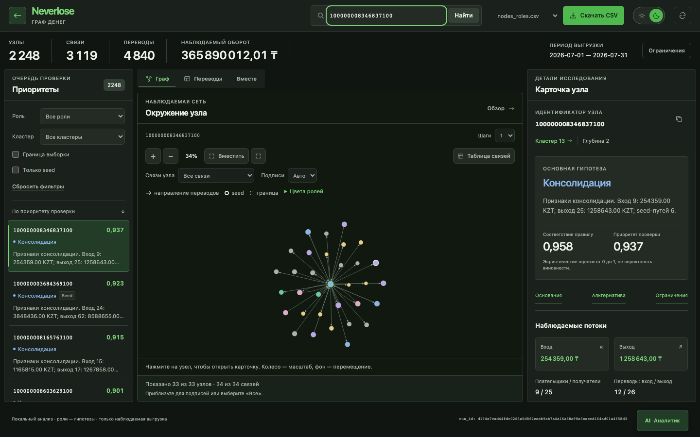
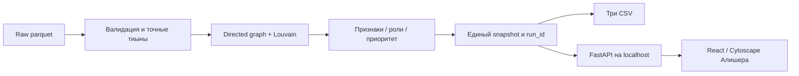

# Neverlose · Граф денег

**Кого из 2 248 участников финансовой сети проверить первым — и почему?**

Neverlose — локальное рабочее место AML-аналитика для кейса Finance / Freedom, HackAlem AI 2026. Приложение превращает три исходных parquet в очередь проверки, направленный граф, гипотезы шести ролей и три обязательных CSV. Аналитик может оспорить каждую гипотезу: открыть исходные переводы, сравнить альтернативу и увидеть, каких данных не хватает. Роли не устанавливают виновность, score не является вероятностью преступления.



Скриншот реального расчёта: легенда ролей и кнопка AI-аналитика справа снизу. Слева — кого проверить; в центре — связи; справа — почему выбран узел. Суммы ведут к исходным переводам. Поиск принимает любой полный gid, включая изолированный seed. Полезный результат работы — объяснимый приоритет, исходные основания и следующий запрос данных, а не только изображение графа.

**Для жюри:** [быстрый старт](#быстрый-старт) → [проверка за пять минут](#проверка-за-пять-минут) → [технологии](#технологии-и-их-назначение) → [алгоритмы](#алгоритмы-и-объяснимость) → [проверенная версия](#проверенная-версия-и-границы-приёмки).

Основной сценарий работает локально после установки: **без ключа, платного API, GPU и Node.js**. Готовая сборка интерфейса включена в репозиторий; Node нужен только разработчику для её пересборки и тестов. Необязательный [AI-аналитик](#необязательный-openai-аналитик-f13) включается отдельно.

## Быстрый старт

Официальный приватный репозиторий: [BAITC-Hacks/hack-1eeed6ff-s-ztech](https://github.com/BAITC-Hacks/hack-1eeed6ff-s-ztech). Для получения исходников нужен предоставленный организатором доступ; работа приложения не требует аккаунта участника.

```bash
git clone https://github.com/BAITC-Hacks/hack-1eeed6ff-s-ztech.git
cd hack-1eeed6ff-s-ztech
python3.12 -m venv .venv
source .venv/bin/activate
python -m pip install -r requirements.lock
python -m pip check
python run.py
```

Откройте **http://127.0.0.1:8000** и нажмите **«Открыть платформу»**. В рабочем окне: **2 248 узлов, 3 119 связей, 4 840 переводов**. В терминале — `status=ready`, `run_id` и время пересчёта; в `results/` — три CSV. Остановка — **Ctrl+C**. Если порт занят: `python run.py --port 8001`, затем откройте порт 8001.

Предварительно нужны установленный **Python 3.12**, Git и доступ организатора к приватному репозиторию. Интернет нужен для получения исходников и зависимостей; после установки основной сценарий автономен. `.env` создавать не нужно. Команды выше предназначены для macOS/Linux shell; проверенные платформы и Windows-вариант указаны ниже.

При настроенном SSH вместо HTTPS можно получить тот же репозиторий командой `git clone git@github.com:BAITC-Hacks/hack-1eeed6ff-s-ztech.git`. SSH-вариант проверен Алишером. Аккаунт или ключ не передаётся приложению.

## Системные требования

Проверено: Python 3.12.14, macOS 26.6.2 arm64, Apple M4, 16 GiB RAM. Для обычного запуска нужны Python 3.12, зависимости из lock, исходные parquet, свободный локальный порт. Второй clean/offline запуск: Apple M2, 8 CPU, 8 GiB, macOS 27.0 arm64, Python 3.12.14. Точный целевой профиль 4 CPU / 8 GB RAM отдельно не измерен. Windows/Linux отдельно не проверены. На Windows эквивалент: `py -3.12 -m venv .venv`, затем `.venv\Scripts\python.exe -m pip install -r requirements.lock`; использовать этот интерпретатор для всех команд без активации.

Python-зависимости: pandas 2.2.3, NumPy 2.3.5, PyArrow 25.0.1, NetworkX 3.7, SciPy 1.18.1, FastAPI 0.141.1, Pydantic 2.13.5, Uvicorn 0.53.0. Транзитивные зависимости зафиксированы в [requirements.lock](requirements.lock). При запуске пакеты не устанавливаются автоматически.

## Запуск и остановка

Обычный запуск из корня с активированным окружением:

```bash
python run.py
```

Он проверяет raw, пересчитывает результат, сохраняет CSV/snapshot и обслуживает `web/dist` тем же процессом. Откройте [http://127.0.0.1:8000](http://127.0.0.1:8000). Проверка готовности — `/health`, метаданные — `/api/v1/meta`; остановка — Ctrl+C.

Переключатель солнце/луна меняет тему, сохраняя выбранный узел и положение графа. Стрелка «На главный экран» возвращает из узла или кластера к обзору, очищая поиск и фильтры. Настройка темы сохраняется локально.

В отдельном терминале с тем же активным окружением проверьте созданные файлы:

```bash
python run.py --verify-only
```

Ожидается JSON с `status: "valid"`, `nodes: 2248`, `clusters: 89`, `top_nodes: 50`. `run_id` должен совпасть с сервером. Проверка сопоставляет результат с исходными данными; роли и суммы не подменяются примером.

Дополнительные режимы для разработки и автоматической проверки:

```bash
# Только raw → CSV, без сервера
python run.py --pipeline-only
# Только API, без интерфейса
python run.py --api-only --port 8001
# Отдельный каталог результата
python run.py --pipeline-only --data data --out work/check-results
```

В `--api-only` корневая страница сообщает об отсутствии подключённого UI; для просмотра графа используйте обычный запуск.

Все параметры:

| Параметр | Значение по умолчанию | Назначение |
|---|---|---|
| `--data` | `data` рядом с run.py | Три исходных parquet |
| `--out` | `results` рядом с run.py | Отдельный каталог результата |
| `--rules` | `config/rules.json` | Опубликованные формулы и пороги |
| `--assistant` | выключен | Включить OpenAI-аналитика на сервере; нужен локальный ключ |
| `--ask` | нет | Вопрос аналитику в CLI; вывод одного JSON, progress в stderr |
| `--gid` | нет | Необязательный точный gid для --ask |
| `--profile` | `official` | Проверка точных hashes организатора; `generic` допускает иные графы с теми же схемой, периодом и порогом |
| `--host` | `127.0.0.1` | Только loopback: 127.0.0.1, localhost или ::1 |
| `--port` | `8000` | Свободный порт 1…65535 |
| `--pipeline-only` | выключен | Пересчёт и завершение |
| `--verify-only` | выключен | Проверка существующего результата, raw/config/hashes; центральности не пересчитываются |
| `--api-only` | выключен | Разработка API без web/dist |

`--pipeline-only`, `--verify-only`, `--api-only` и `--ask` взаимоисключающие. Для основного сценария переменные окружения, `.env`, API-ключи, платные сервисы, GPU и внешняя модель не требуются. Каталог вывода не может перекрывать raw или содержать посторонние файлы.

## Проверка за пять минут

После запуска выполните маршрут ниже. Примеры взяты из текущего результата, в алгоритм не зашиты; проверка произвольного gid обязательна для самостоятельной оценки.

| Действие | Ожидаемый результат |
|---|---|
| Сверьте шапку с `/api/v1/meta` | 2248 узлов, 3119 связей, 4840 переводов; июль 2026; один `run_id` |
| Найдите `100000008346837100` | Гипотеза «Консолидация», кластер 13. Вход 254359.00 KZT, выход 1258643.00 KZT; это наблюдаемые потоки, не полный баланс |
| Откройте «Основания», затем «Альтернатива» | Условия правила и альтернативная гипотеза распределения; score обозначен как эвристика |
| Нажмите сумму входа/выхода | Исходные переводы соответствующего направления; у строк есть `source_ref` и позиция в transactions.parquet. Итог относится ко всей выборке, а не странице |
| Найдите `100000001053894100` | Предупреждение «Граница выборки», роль peripheral; отсутствие выхода не объявляется накоплением денег |
| Найдите `100000000456947100` | Изолированный seed: 1 узел / 0 связей, роль peripheral, role_score и priority_score равны 0; карточка непустая |
| Выберите собственный gid из raw командой ниже | Поиск открывает его независимо от фильтров очереди; точные цифры сохраняются |
| Откройте кластер, затем «На главный экран» | Статистика кластера и возврат к обзору; поиск/фильтры очищены |
| По очереди скачайте три CSV | 2248/89/50 строк данных соответственно, схемы перечислены ниже; gid импортируйте в Excel как текст |
| Выполните `python run.py --verify-only` | `valid`, те же counts и `run_id`; после установки повторите маршрут без внешней сети |

Произвольный gid непосредственно из исходного файла:

```bash
python -c 'import secrets, pyarrow.parquet as pq; print(secrets.choice(pq.read_table("data/nodes.parquet", columns=["gid"]).column("gid").to_pylist()))'
```

[Автоматические проверки](#проверка-результата) подтверждают также побайтовое равенство CSV из браузера, API и файлов расчёта. [Сценарий выступления](docs/demo.md) отделён от самостоятельной проверки жюри.

## Технологии и их назначение

| Технология | Зачем используется |
|---|---|
| Python 3.12, PyArrow, pandas, NumPy | Чтение parquet, проверка схем и исходных агрегатов; расчёт денег в целых тиынах |
| NetworkX, SciPy | Направленный граф, PageRank/betweenness, seed-достижимость, Louvain и структурная симуляция |
| FastAPI, Pydantic, Uvicorn | Типизированный локальный API и раздача интерфейса из одного snapshot |
| React 19, TypeScript, Vite | Интерфейс, проверка контрактов и воспроизводимая сборка |
| Cytoscape.js | Направленный граф, выбор узла, масштабирование и доступная таблица связей |
| pytest, Vitest, Playwright | Инварианты данных, отказы, unit и настоящий browser/API/CSV сценарий |
| OpenAI Responses API — опционально | Выбор инструментов и проверенных оснований для ответа; основной расчёт от модели не зависит |

Точные версии: [requirements.lock](requirements.lock), [requirements-dev.lock](requirements-dev.lock), [web/package-lock.json](web/package-lock.json). Происхождение и лицензии: [THIRD_PARTY.md](THIRD_PARTY.md), [тексты notices готового bundle](THIRD_PARTY_NOTICES.txt).

## Интерфейс и сборка

Ответственность Алишера: React 19 / TypeScript / Vite / Cytoscape, поиск, граф, карточки, браузерные проверки. Контракт принят B на `7266a72`; [контракт и оболочки](contracts/README.md), [synthetic fixture](contracts/v1.example.json), [настоящий ответ API](contracts/v1.actual.json). Fixture не является результатом и не используется в production fallback.

Для пересборки нужен Node >=22.12 и npm. На A build/unit проверены с Node 26.9.0; установка браузера и E2E — с Node 24.19.0, на B — с Node 25.2.1. Для воспроизведения всего цикла на A использовался Node 24.19.0: распаковка браузера под Node 26.9.0 зависла, приложение это не затрагивало.

```bash
cd web
npm ci
npm test -- --run
npm run build
npx playwright install chromium
npm run test:e2e
# При работающем python run.py на localhost:8000:
npm run test:integration
```

Не заменять `npm ci` обновлением до latest. Contract E2E используют явно synthetic HTTP-ответы; integration тесты обращаются к настоящему серверу и сверяют скачанные CSV с API и файлами. При другом порте задайте `NEVERLOSE_BASE_URL=http://127.0.0.1:8001`; при другом каталоге результатов — `NEVERLOSE_RESULTS=/полный/путь/к/results`. Это настройки тестов, не обязательные переменные приложения. Фактические проверки — в [validation](docs/validation.md).

## Данные и результаты

| Файл | Строк | Поля |
|---|---:|---|
| `data/nodes.parquet` | 2 248 | gid:int64, depth:int64, is_seed:bool |
| `data/edges.parquet` | 3 119 | src:int64, dst:int64, sum_kzt:float64, n_tx:int64, depth:int8 |
| `data/transactions.parquet` | 4 840 | src:int64, dst:int64, date:day, sum_kzt:float64 |

81 seed, июль 2026, порог 5 000 KZT, только внутрибанковские исходящие пути до четырёх колен. Сумма наблюдаемых переводов **365 890 012,01 KZT** — не объём уникальных денег. Hashes/схемы: [официальный manifest](docs/hackalem/sources/manifest.json), [выполненный loader audit](docs/hackalem/evidence/a1-loader.json).

97 повторяющихся транзакций сохраняются: банковского ID нет, исходные агрегаты учитывают все строки. 19 изолированных seed остаются в графе, отдельных кластерах и выгрузках. Всего 35 слабых компонент со всеми узлами.

```text
results/nodes_roles.csv  gid,role,role_score,cluster_id,priority_score,evidence
results/clusters.csv     cluster_id,n_nodes,n_seed,sum_kzt_internal,top_gids,hypothesis
results/top_nodes.csv    rank,gid,role,priority_score,why
results/snapshot.json    Полные признаки, правила, переводы, ограничения, config и run_id
results/manifest.json    Hashes входов/выходов, версии, размеры и длительность
```

CSV — UTF-8, точные десятичные gid, score с 6 знаками. Evidence непустой и не длиннее 200 Unicode-символов. `top_gids` в CSV разделены `;`, в JSON это массив строк. Все исходные узлы присутствуют ровно один раз. Топ — первые min(50,N); на официальных данных 50. Ранжирование использует полный score до округления и затем меньший gid.

Фактический первый расчёт: 89 кластеров; consolidator 113, distributor 102, coordinator 8, transit 63, peripheral 884, terminal 1078. Это результат опубликованных эвристик v1, а не разметка истинных ролей.

## Алгоритмы и объяснимость

Версия вычислительного кода `1.0.2`: поле `why` объясняет приоритет через число плательщиков/получателей и наблюдаемые суммы. Роли, скоры, порядок приоритетов и кластеры сохранены; изменился текст `top_nodes.csv` и идентификатор расчёта. Подробные формулы: [02_DATA_ALGORITHMS.md](docs/hackalem/02_DATA_ALGORITHMS.md). Действующие параметры: [config/rules.json](config/rules.json), версия `v1`.

Деньги проверяются на точность до тиына: `abs(100*x-round(100*x))<=1e-6`. Масштабирование целых (включая точно целые float) выполняется без промежуточного float; дробные исходные значения проверяются через Decimal. После проверки все суммы агрегируются целыми Python int. Пары/число операций/суммы tx сверяются с edges; допустимое различие до 1 тиына фиксируется, каноническая сумма берётся из tx. Неизвестный endpoint, null, inf, self-loop, неверный период, тип или точность останавливают расчёт.

Граф включает все nodes. PageRank: alpha=.85, tol=1e-8, max_iter=500, денежный вес. Betweenness: directed, normalized, **без весов расстояния**, выборка k=min(128,N), seed=42. Seed-reach — число разных seed с направленным путём длиной 1…4, исключая сам seed. Louvain: неориентированная проекция со **суммой обоих направлений**, resolution=1, threshold=1e-7, seed=42. Несвязные части сообществ разделяются; изоляты — singleton. ID кластеров: размер desc, минимальный gid asc.

Обозначения: I/O — наблюдаемый вход/выход, a/b — число разных отправителей/получателей, s — seed-reach, r=O/I при I>0, C — разнообразие кластеров соседей по обороту, B — betweenness. `P(x)` — ранг среди положительных значений, ties включаются полностью, для нуля P=0. `clip` ограничивает 0…1.

| Роль | Условие | Raw score |
|---|---|---|
| consolidator | a≥3 | .45·clip(a/8)+.25·P(I)+.30·clip(s/3) |
| distributor | b≥5 | .60·clip(b/20)+.40·P(O) |
| transit | не seed/boundary, a,b≥1, I>0, .8≤r≤1.2 | .60·clip(1−abs(1−r)/.2)+.20·clip(min(a,b)/3)+.20·P(min(I,O)) |
| terminal | не seed, depth<4, a≥1, b=0, I>0 | .50+.25·P(I)+.25·clip(a/3) |
| coordinator | depth<4, a,b≥2, s≥2, C≥.30, P(B)≥.90 | .35·P(B)+.25·C+.20·clip(s/5)+.20·P(PageRank) |
| peripheral | нет допустимого кандидата / изолят | .20 / 0 |

Выбор по наибольшему raw score. Ties: coordinator → consolidator → distributor → transit → terminal. Затем применяются caps: coordinator .55; terminal/boundary/seed .65; одна операция или меньше .45. Это консервативные соглашения, не статистическая калибровка. Все кандидаты, условия pass/fail, raw/capped score и действующие caps доступны в карточке API. Альтернатива — следующая допустимая роль, иначе null с объяснением недостаточности данных.

Приоритет: `.30·P(I+O)+.25·P(B)+.20·clip(s/5)+.15·max(P(a),P(b))+.10·C`. Для изолята ноль. Пять вкладов публикуются отдельно; сумма сверяется с итогом до 1e-12. Seed не даёт прямого бонуса, низкий role_score не скрывает важный узел.

Диагностика чувствительности: в восьми вариантах порогов состав top-20 сохранился, роли изменились у 0–4.98% узлов. Louvain resolution 0.8/1.2 даёт 83/98 кластеров. Это не измерение accuracy; исходные параметры сохранены. [Фактические результаты](docs/hackalem/evidence/a2-sensitivity.json).

Перевод имеет `source_ref=tx:<12 символов SHA-256>:<source_row>`; source_row — 0-based физическая строка parquet, не банковский transaction_id. Совпадающие платежи имеют разные ссылки. Переводы сортируются по date, затем source_row. Суммы API transfers относятся ко всей выбранной direction, а не текущей странице. Краткая Markdown-справка доступна в `/api/v1/nodes/{gid}/brief`.

Структурная симуляция E1: `POST /api/v1/experiments/removal` принимает 1–3 разные строки gid. Она сравнивает число связанных неупорядоченных пар **среди оставшихся вершин** до и после удаления. Исходные слабые компоненты ещё допускают пути через выбранные узлы; после удаления эти пути исчезают. При нулевом знаменателе доля равна null. Возвращаются также число компонент, крупнейшая компонента и удалённые направленные рёбра. Это проверка топологии всей наблюдаемой сети, не прогноз денежных потерь; CSV, роли и приоритеты не меняются. [Контракт и пример](contracts/removal-v1.md). UI-панель пока не включена.

## Куда сходятся переводы выбранной группы

Это практический вопрос из кейса Freedom: найти получателей, которым переводит каждый из выбранных счетов. Откройте **AI Аналитик → Общие получатели · без API-ключа**, вставьте от 2 до 5 полных gid и нажмите «Найти общих получателей». Можно также добавлять текущий выбранный узел по одному: закрытие панели сохраняет группу.

Для воспроизводимого примера вставьте:

```text
100000008748914100
100000008304139100
100000003880331100
100000004358004100
100000003528285100
```

Ожидаемый результат на приложенной выгрузке: **1 получатель — `100000003684369100`, 2 874 700.00 KZT, 31 операция от всех 5 отправителей**. Раскройте вклад каждого и идентификаторы исходных строк; полные переводы доступны в карточке получателя. Это сумма переводов выбранной группы, а не полный входящий оборот получателя и не доказательство координации.

Расчёт выполняется локально по всем исходным строкам, с точными суммами и сохранением повторов. При отсутствии совпадений показан честный пустой результат. «Подготовить вопрос AI» переносит точную группу в вопрос; модель вызывается только после «Задать вопрос». При успешном вызове инструмента сервер проверяет полный набор распознанных gid и условие «от всех», затем обязательно показывает каждого выданного получателя, число всех совпадений и ограничения. Выбор инструмента и понимание вопроса остаются задачей модели. [Контракт и ограничения](contracts/common-recipients-v1.md).

## Необязательный OpenAI-аналитик (F13)

Панель помогает разобрать роль и альтернативу, проверить исходные переводы и выбрать следующий запрос данных. Поддерживаются вопросы по текущему графу; добавлен поиск общих прямых получателей 2–5 явно указанных счетов. Произвольные вычисления и трассировка маршрутов не реализованы. Обзор содержит пять лидеров, список соседей ограничен 20 связями.

Для проверки жюри со своим ключом:

1. В корне проекта выполните `cp .env.example .env` (Windows PowerShell: `Copy-Item .env.example .env`).
2. Откройте **локальный `.env`** в редакторе и заполните строку `OPENAI_API_KEY=ваш_собственный_ключ`. Поле в опубликованном `.env.example` намеренно пустое. `OPENAI_MODEL` можно оставить без изменения.
3. Если обычный сервер уже работает, остановите его через Ctrl+C. В активном Python-окружении выполните `python run.py --assistant`.
4. Откройте `http://127.0.0.1:8000`, нажмите «Открыть платформу», выберите узел и кнопку **AI Аналитик** справа снизу. Например: «Покажи исходные переводы и ограничения вывода». Нажмите «Задать вопрос»; проверьте ссылки и «Сохранить ответ».

Для этого дополнительного режима нужны интернет и действующий OpenAI API-ключ с доступом к указанной модели и оплатой запросов. Ключ хранится только на сервере; браузер его не получает. При изменении `.env` перезапустите сервер. Не загружайте `.env` в GitHub.

Основному сценарию этот раздел не нужен. После `cp .env.example .env` укажите свой ключ в `OPENAI_API_KEY` через локальный редактор. `.env` исключён из Git; не помещайте ключ в командную строку, browser/VITE переменные или коммиты. По умолчанию модель `gpt-6-astra`, проверенная настоящими запросами 23.09.2026. Более экономный вариант `OPENAI_MODEL=gpt-5.4-mini-2026-03-17` также прошёл проверку. Astra использует reasoning `low` с ограничением времени и токенов. Это выбор модели для MVP, не доказательство превосходства на любых вопросах. `OPENAI_MODEL` позволяет указать доступную вашему аккаунту Responses-модель. Переменные окружения имеют приоритет над `.env`.

```bash
# Отдельный вопрос: JSON ответа, citations и tool_trace в stdout
python run.py --ask "Покажи приоритетные узлы и ограничения анализа"
# Точный gid можно передать без потери цифр:
python run.py --ask "Объясни роль и следующий запрос данных" --gid 100000000456947100
# Включённый серверный endpoint для интерфейса или HTTP-клиента:
python run.py --assistant
```

`POST /api/v1/agent/query` принимает `{"question":"вопрос","gid":null}` или точную строку gid. Непустой вопрос до 2000 символов. [Полный контракт](contracts/agent-v1.md), [настоящий ответ с исходным переводом](contracts/v1.agent.actual.json). Нажмите **AI Аналитик справа снизу**: выберите контекст узла, напишите вопрос и нажмите «Задать вопрос». Ответ содержит основания, ссылки на текущий API, переход к узлу, фактические вызовы инструментов и кнопку «Сохранить ответ». Само открытие панели не отправляет запрос. На обычном `python run.py` ключ не читается, `features.agent=false`, endpoint возвращает 503 `AGENT_DISABLED`.

Это реальный цикл модели: выбор read-only инструментов → карточка/соседи/переводы/кластер/гипотезы/справка/общие получатели → оценка достаточности → выбор и порядок проверенных утверждений. Чтобы модель не сочиняла суммы и ссылки, финальная строгая схема содержит только status и ID утверждений, реально возвращённых инструментами. Сервер проверяет выбранный gid, ссылки и наличие ограничений и формирует Markdown. Свободного текста финансовых фактов, произвольного кода, веб-поиска и банковских действий нет. Выбор релевантных оснований моделью всё равно требует оценки аналитика; отсутствие вымышленных чисел не доказывает полноту ответа.

Одновременно один вопрос, не более 6 обращений к модели и 8 инструментов, 1800 output tokens на обращение и 7200 суммарно; общий бюджет времени 120 s, сетевой timeout до 35 s. На границе времени/токенов, при refusal/incomplete или неизвестных ссылках — явная ошибка, без подставного успешного ответа. `tool_trace` не содержит API-ключа или скрытых рассуждений. Роли/CSV/snapshot не меняются. Другие запросы основного API обслуживаются независимо.

При запросе помощнику вопрос и выбранные обезличенные факты передаются OpenAI; нужны интернет и оплачиваемый API. Используется `store:false`, что не означает безусловного zero retention: [данные провайдера](https://developers.openai.com/api/docs/guides/your-data). При недоступном API используйте тот же граф/карточки/CSV локально. Проверка жюри не зависит от ключа участника.

Реально проверены: исходный перевод с source_ref, сопоставление основной/альтернативной ролей, отказ от установления личности/виновности/полного баланса по boundary и CLI для изолята. Provider mocks проверяют только протокол и отказы; отдельно выполнены 4 настоящих вопроса (12 Responses-вызовов). Фактические ответы и токены — в [проверках API/CLI](docs/hackalem/evidence/f13-a/report.json). Затем выполнены ещё два настоящих вопроса **из браузера** (5 Responses-вызовов, 12168 входных / 539 выходных токенов): роль/альтернатива и исходные переводы со ссылками. Проверены сохранение ответа, доступность источников и неизменность CSV: [проверки панели](docs/hackalem/evidence/agent-ui-a/report.json).

## Архитектура



`run_id` — SHA-256 от source hashes, полного config, algorithm_version и точных версий вычислительных библиотек. Время записывается отдельно. GET не запускает пересчёт. API держит snapshot и байты CSV в памяти одного запуска, поэтому параллельный последующий CLI-пересчёт не смешивает данные сервера.

Новый результат готовится в соседнем временном каталоге и проверяется до активации. Замена каталога имеет rollback при ошибке переименования; это не универсальная атомарная замена директорий при аварийном выключении ОС. Если восстановление также не удалось, прежние результаты сохраняются в соседнем `.<out>-recovery-<id>`; точный путь выводится в ошибке. Один output защищён lock-файлом от двух писателей. Проверка сопоставляет snapshot с каждой исходной строкой перевода и ребром, а не только с общим количеством. Исходные данные не изменяются. БД отсутствует; внешний OpenAI используется только явно включённым необязательным помощником.

| Каталог | Назначение |
|---|---|
| `app/` | loader, graph/features, clusters, roles, ranking, explanations, pipeline, schemas, API |
| `config/` | Версионированные пороги и веса |
| `tests/` | Искусственные графы, raw-инварианты, API/CSV и отказоустойчивость |
| `contracts/` | Договор A/B, synthetic и реальные примеры |
| `data/`, `starter/` | Оригинальные материалы организатора, без изменений |
| `results/` | Генерируемый проверяемый результат |
| `web/` | Интерфейс Алишера, production dist, unit/browser/integration tests |
| `docs/hackalem/`, `docs/progress/` | ТЗ, источники, критерии, фактическая история |

API: `/api/v1/meta`, `/nodes`, `/nodes/{gid}`, `/nodes/{gid}/transfers`, `/graph`, `/clusters`, `/clusters/{id}`, `/exports/{name}`, `/nodes/{gid}/brief`. Оболочки/фильтры/ошибки описаны в [contracts/README.md](contracts/README.md), схема OpenAPI доступна локально в `/openapi.json`. Gid/src/dst — строки; денежные поля `*_kzt` — строки с двумя знаками. Пагинация 1…200, граф 1…1000 вершин; укороченный граф сообщает matched/shown counts.

## Проверка результата

```bash
python -m pip install -r requirements-dev.lock
python -m pytest tests -q
python -m ruff check app tests run.py
python -m compileall -q app run.py
python run.py --pipeline-only
python run.py --verify-only
```

Проверены соседние 18-значные gid, все исходные узлы, денежные агрегаты, дубли, self-loop/ошибки, boundary, seed, нулевой вход, шесть ролей, caps/ties, кластеры, приоритет, повторный и перемешанный вход, raw↔CSV, API-пагинация и ограничения графа. Актуальные числа тестов и ограничения проверки — [docs/validation.md](docs/validation.md).

Для самостоятельной проверки интерфейса:

1. Открыть локальное рабочее место, сверить counts/period/run_id с `/api/v1/meta`.
2. Выбрать любой узел очереди, сверить gid/роль/score с `nodes_roles.csv`.
3. Проверить исходные переводы и сумму всей выборки; открыть следующую страницу.
4. Ввести любой полный gid из `data/nodes.parquet`, независимо от фильтров очереди.
5. Открыть boundary и изолированный seed; проверить предупреждения и отсутствие ложного terminal.
6. Проверить кластер, кандидатов/альтернативу, следующий запрос данных и скачать три CSV.
7. После установки отключить сеть и повторить основной сценарий.

Последовательность выполнена на двух ноутбуках, включая новый clone и запрет внешней сети для проверяемых процессов. Команды, версии, screenshots и точные границы проверки записаны в [validation](docs/validation.md) и [повторе R1 на втором ноутбуке](web/evidence/r1/release-retest.json).

## Производительность и offline

На Apple M4 / 16 GiB / macOS 26.6.2 полный Python-вызов raw→CSV с проверкой занял 0,808 с; CLI `--pipeline-only` — 0,883 с (импорты/установка пакетов вне этого таймера). Первый HTTP smoke: карточка 2,398 мс, ego 2,185 мс локально; это единичные измерения, не нагрузочный SLA. 2 248/3 119/4 840 входных строк; 2 248/89/50 строк в трёх CSV.

Сеть нужна для первоначального получения исходников и пакетов. Runtime ядра/API/UI не требует внешних сервисов. На A три сквозных браузерных сценария прошли с OS-запретом внешних исходящих соединений для сервера и тестового браузера; loopback разрешён. Поиск, граф, переводы и три CSV работали. Это проверка изоляции процессов, а не заявление об отключении всего ноутбука от сети. Универсальная установка без сети на неизвестной ОС не обещается: для неё нужен заранее проверенный wheelhouse для конкретной платформы. Личные .venv/.env не являются частью результата.

## Ограничения выводов

- 444 depth=4/out=0 — граница выгрузки; ни один не получает terminal только из-за отсутствующего выхода.
- Входящие и начальные остатки неполны. 354 узла имеют O>I при I>0, ещё 23 — нулевой вход при положительном выходе. Это не доказательство аномалии баланса.
- Конец наблюдаемого маршрута до depth=4 также не доказывает удержание денег. Координация — структурная гипотеза.
- Нет ФИО, ИИН, атрибутов клиента, других банков, точного времени суток и ground truth. Внешнее обогащение и вымышленные личности не используются.
- Louvain/центральности и пороги — эвристики. Число кластеров не подгоняется под замечания постановщика; accuracy/F1 не заявляются.
- Главный сценарий локальный, loopback-only, без банковской авторизации. Публичный production deployment не реализован.
- E1 доступен через API; UI-панель ещё не включена. E2 не реализован. AI-аналитик доступен в панели, API и CLI; по умолчанию выключен. Детерминированные объяснения ядра работают независимо от него.

## Масштабирование до миллиона узлов

Текущая реализация проверена только на предоставленном объёме. Для ~1 млн узлов нужны колоночное/порционное чтение parquet, компактный графовый движок и adjacency, пересмотр стоимости Louvain/центральностей, предрасчёт ограниченных соседств и агрегаций, offline-расчёт дорогих метрик. UI должен получать ограниченные срезы и уровни детализации, а не весь граф. Сначала профиль памяти/времени, затем выбор распределённой инфраструктуры; это направление развития, не реализованный benchmark.

## Устранение ошибок

| Симптом | Действие |
|---|---|
| Нет Python 3.12 | Проверить `python --version`; создать .venv именно интерпретатором 3.12 |
| ModuleNotFoundError | Активировать .venv, выполнить установку из lock и `python -m pip check` |
| Ошибка precision/aggregate/hash | Не ремонтировать суммы вручную; повторно получить оригинальные файлы и сверить source manifest |
| Нет web/dist | Получить интегрированный commit или выполнить `npm ci` / `npm run build` в web |
| Порт занят | Остановить свой предыдущий сервер Ctrl+C или использовать `--port 8001` |
| Gid округляется в Excel | Импортировать колонку как текст; CSV сохраняет точные цифры |
| Узел не найден | Использовать полный gid; поиск относится ко всему набору, фильтры очереди не меняют данные |
| Pipeline lock | Убедиться, что другой пересчёт не выполняется; только затем удалить указанный в ошибке stale lock |
| Нет сети после install | Использовать установленные зависимости; не требуется API-key или облачный сервис |

Не скрываем повреждение данных заменой на fixture. При ошибке предыдущий успешный output сохраняется, но новый запуск не объявляется успешным.

## Команда, источники и сдача

Мейрам (A) — данные, алгоритмы, API, CSV, README и интеграция; Алишер (B) — интерфейс, граф, карточки, браузерные проверки и демо. Ветки: `codex/analysis-core`, `codex/workspace-ui`; merge сохраняет историю. Codex помогал в проектировании, реализации и тестировании зоны A. Фактические компоненты и происхождение starter/data раскрыты в [THIRD_PARTY.md](THIRD_PARTY.md). Данные разрешены только в рамках хакатона; не переиздаются как open data.

Оригинальный starter не является готовым решением команды. Основная функциональность создана в соревновательном окне. [Официальное ТЗ](docs/hackalem/sources/official-case.ru.txt), [положение](docs/hackalem/sources/rules-extracted.txt), [матрица сдачи](docs/hackalem/07_RULES_DELIVERY.md), [полное ТЗ](docs/hackalem/README.md).

## Проверенная версия и границы приёмки

Приложение строит граф, роли, кластеры и три CSV; поиск, исходные переводы, альтернативные гипотезы, обе темы и AI-панель проверены в браузере. Проходят 217 backend-тестов, 43 frontend-теста, 64 браузерные contract-проверки и 5 сквозных сценариев на настоящих данных с запрещённой внешней сетью; отдельно подтверждены настоящие вопросы к OpenAI. Структурная симуляция пока доступна через API, временные паттерны не реализованы; основной сценарий работает без ключа. Чистый clone версии `f45632f` с новым venv прошёл offline-проверку: расчёт за 1.10 s и побайтовое совпадение трёх CSV. Новый сценарий общих получателей проверен отдельно в offline-браузере и настоящим вопросом Astra. [Свежий отчёт](docs/hackalem/evidence/common-a/report.json). Точный SHA: `git rev-parse HEAD`; [проверки и ограничения](docs/validation.md), [текущее состояние](docs/hackalem/STATUS.md), [порядок подачи](docs/SUBMISSION.md).

[Итоговая сверка ТЗ и замечаний внешнего ревью](docs/hackalem/FINAL_AUDIT.md) содержит покрытие требований, ограничения агента и приоритетные направления развития.
