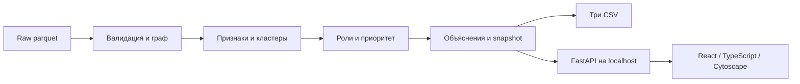

# Neverlose · Граф денег

Официальный репозиторий команды Neverlose: `hack-1eeed6ff-s-ztech`.

HackAlem AI 2026 · Финансы / Freedom · Мейрам и Алишер.

**Реализация начата: Python 3.12 окружение и lock-файлы установлены и проверены, контракт v1 и synthetic fixture доступны в `contracts/`. Loader и граф реализованы, 21 тест пройден; роли/API/UI ещё разрабатываются.** В репозитории есть оригинальные данные и starter организатора, аудит, архитектура, алгоритмы, интерфейсная спецификация, персональные задания, проверки и контекст AI. Наличие этих документов не означает, что финальный продукт уже запускается или сдан.

**Главный приоритет команды — строгое соблюдение официального положения.** Полный, правдивый README и самостоятельный запуск экспертом являются частью результата. Будущие команды ниже явно помечены как проектные; после реализации этот README должен быть обновлён по реальным проверкам, а не по намерениям.

## Быстрое начало работы вдвоём

| Кто | Открыть первым | Ответственность |
|---|---|---|
| **Мейрам** | [Личное ТЗ](docs/hackalem/MEIRAM.md) | Данные, расчёты, роли/кластеры/priority, API, CSV, README, интеграция и выпуск |
| **Алишер** | [Личное ТЗ](docs/hackalem/ALISHER.md) | UI, граф, карточки, гипотезы/переводы, браузерная проверка, демо, независимый clean launch |
| Оба | [Пошаговый план](docs/hackalem/05_IMPLEMENTATION_PLAN.md) | Общий календарь, передачи, гейты и сокращение scope |

Начинать с проверки фактического остатка времени и [STATUS](docs/hackalem/STATUS.md). У каждого собственный checkout официального репозитория и ветка; Мейрам — `codex/analysis-core`, Алишер — `codex/workspace-ui`. Один пишущий AI на checkout; второй инструмент может проверять read-only. Готовые промпты: [для Мейрама, Алишера и ревью](docs/hackalem/09_PROMPTS.md). Для новой сессии: [самодостаточный контекст](docs/hackalem/08_SESSION_CONTEXT.md), `AGENTS.md` и `CLAUDE.md`.

## Задача и результат продукта

По сети из 2 248 узлов нужно определить, **кого аналитику проверять первым и почему**. Проектируемое рабочее место показывает очередь приоритетов, направленный граф, роль узла, фактические признаки, переводы-основания, альтернативную гипотезу и ограничения наблюдения. Выводы — гипотезы для проверки, не утверждения о виновности.

Отличие: число и роль можно проверить до исходной строки данных; рядом показано, чего не хватает для более сильного вывода. Платный LLM не нужен для воспроизведения основного результата. Использование AI при разработке не означает, что приложение обязано отправлять банковский граф внешней модели.

UI: строго профессиональный аналитический workspace, **без градиентов, glow, glassmorphism и шаблонных AI-экранов**. Плоские нейтральные поверхности, функциональные цвета, точные числа, плотная рабочая компоновка. [Подробная спецификация интерфейса](docs/hackalem/04_INTERFACE.md).

## Официальные сроки и условия

Пользователь подтвердил окно **23 сентября 2026, 13:00–18:00 Астана (UTC+5)**, без изменения времени. Личный поздний старт не переносит 18:00. Эталонный план на 300 минут включает уже прошедшее исследование; при начале реализации выбирать сокращённый маршрут по оставшемуся времени.

Основная разработка — только в этом официальном репозитории. Сохраняются фактические коммиты и промежуточный результат каждого часа; заранее готовое ядро нельзя представлять как разработанное на хакатоне. AI-инструменты разрешены. Организационные требования check-in и присутствия выполняют участники; этот README не подтверждает их прохождение.

Итоговая оцениваемая версия фиксируется в 18:00, включая дальнейший Demo Day. Исправления после deadline не включаются в оценку. Если проект не запускается по README, он не допускается дальше; поздние пояснения и исправления не принимаются. Подробная [матрица соблюдения и сдачи](docs/hackalem/07_RULES_DELIVERY.md), [официальное положение](https://edu.astanahub.com/hackathons/df4743f5-c492-415c-b45a-1f13adb78e06).

## Что действительно есть в репозитории

```text
data/                         Оригинальные parquet и README датасета
starter/                      Оригинальный starter организатора, без правок
docs/hackalem/                 Полное ТЗ, алгоритмы, контракты и план
docs/hackalem/MEIRAM.md        Персональное задание Мейраму
docs/hackalem/ALISHER.md       Персональное задание Алишеру
docs/hackalem/sources/         Снимки исходных требований и manifest
docs/hackalem/evidence/        Фактические результаты исследования данных
docs/progress/hour-1.md        Фактический промежуточный результат первого часа
AGENTS.md / CLAUDE.md          Контекст для инструментов разработки
THIRD_PARTY.md                 Происхождение материалов и раскрытие компонентов
```

Нет готового `app/`, `run.py`, `web/`, финального `results/` или тестов приложения. Оригинальный starter пишет пустые роли и пустые clusters/top: он не является выполненным решением задачи.

## Навигация по полному ТЗ

| Документ | Содержание |
|---|---|
| [Обзор пакета](docs/hackalem/README.md) | Порядок работы и все материалы |
| [Продукт](docs/hackalem/01_PRODUCT_SPEC.md) | Сценарии, требования F01–F13, scope |
| [Данные и алгоритмы](docs/hackalem/02_DATA_ALGORITHMS.md) | Схемы, точность, шесть ролей, формулы и ограничения |
| [Архитектура и API](docs/hackalem/03_ARCHITECTURE_CONTRACTS.md) | Стек, структура, CLI, JSON, CSV, ошибки |
| [Интерфейс](docs/hackalem/04_INTERFACE.md) | Компоновка, цвета, граф, состояния, доступность |
| [План 300 минут](docs/hackalem/05_IMPLEMENTATION_PLAN.md) | Два параллельных потока, проверки, сокращённые варианты |
| [Матрица качества](docs/hackalem/06_QUALITY_GATES.md) | Данные, алгоритмы, API/UI, reproducibility и AI-review |
| [Правила и сдача](docs/hackalem/07_RULES_DELIVERY.md) | Пункты положения, часы, submission, пяти минутное демо |
| [Новая сессия](docs/hackalem/08_SESSION_CONTEXT.md) | Сохранённые решения и фактический контекст |
| [Промпты](docs/hackalem/09_PROMPTS.md) | Исполнители и review |
| [Аудит источников](docs/hackalem/10_SOURCE_AUDIT.md) | Подтверждённые числа, ошибки starter и hashes |
| [Требования к финальному README](docs/hackalem/11_README_REQUIREMENTS.md) | 24 обязательных раздела и независимая проверка |
| [Решения](docs/hackalem/DECISIONS.md) / [состояние](docs/hackalem/STATUS.md) | Что принято, что сделано и что дальше |

## Входные данные

| Файл | Строк | Схема |
|---|---:|---|
| `data/nodes.parquet` | 2 248 | gid, depth, is_seed |
| `data/edges.parquet` | 3 119 | src, dst, sum_kzt, n_tx, depth |
| `data/transactions.parquet` | 4 840 | src, dst, date, sum_kzt |

81 seed, период 2026-07-01…2026-07-31, только внутрибанковские исходящие пути на четыре колена, порог 5 000 KZT. Наблюдаемый оборот — 365 890 012,01 KZT. Суммы/количества/пары согласованы; null, дубликатов узлов и неизвестных endpoints нет.

Обязательные особенности реализации:

- **gid — 18-значные целые выше безопасного диапазона JavaScript.** В API/JS только строки, иначе возможна потеря точности.
- **97 совпадающих строк tx сохраняются.** Банковского transaction_id нет, а исходные агрегаты учитывают все строки.
- **19 изолированных seed сохраняются** во всех результатах. Всего 31 seed без исходящих.
- **444 узла depth=4/out=0 — граница выгрузки**, не доказанный конечный получатель.
- 35 слабых компонент со всеми nodes, 16 только с рёбрами; вне крупнейшей 371 всего/352 с рёбрами.
- 354 узла out>in при положительном in, плюс 23 при нулевом in. Это ограничение видимости входящих, не доказательство аномалии баланса.

Подробные hashes и распределения в [аудите](docs/hackalem/10_SOURCE_AUDIT.md). Оригиналы не исправлять и не удалять «дубли» автоматически.

## Целевая архитектура и стек



Python 3.12, pandas, NumPy, PyArrow, NetworkX, **SciPy**, FastAPI/Pydantic/Uvicorn. Frontend: React/TypeScript/Vite, Cytoscape.js, обычный CSS; Node 22.12+ для сборки. Нет обязательной БД, GPU, внешней модели или платного API. Точные совместимые версии будущего приложения фиксируются lock-файлами после проверки; сейчас весь этот стек ещё не установлен/проверен как готовый продукт.

В исследовательском окружении проверен оригинальный starter с Python 3.12.14, pandas 2.2.3, NumPy 2.3.5, PyArrow 25.0.1, NetworkX 3.7, SciPy 1.18.1. Без SciPy его PageRank завершался ошибкой; после установки — успешный запуск за 2,457 с. Это время оригинального starter, **не полного приложения**.

## Установка и запуск — состояние сейчас и целевой контракт

Сейчас можно изучить оригинальный [starter/README.md](starter/README.md) и проверить исходные материалы. Готового запуска приложения нет. `starter.py` не выдаёт готовые роли, кластеры или топ.

После реализации Мейрам должен обеспечить следующую установку и подтвердить её вместе с Алишером:

```bash
python3.12 -m venv .venv
source .venv/bin/activate
python -m pip install -r requirements.lock
python -m pip check
python run.py
```

**Эти команды — пока проектный контракт:** requirements.lock/run.py появятся при реализации. Целевое поведение `python run.py`: raw→проверка→расчёт→три CSV→локальный UI на `http://127.0.0.1:8000`. Собранный web/dist включается в финальный commit; Node не требуется для каждого запуска жюри.

Целевые дополнительные режимы: `--pipeline-only`, `--verify-only`, `--data`, `--out`, `--host`, `--port`. Для Windows запланирован прямой запуск `.venv\Scripts\python.exe` без обязательной активации; поддержку заявлять после фактической проверки. Подробный [контракт запуска](docs/hackalem/03_ARCHITECTURE_CONTRACTS.md).

Основной сценарий не предполагает переменных окружения, API-ключей и личных подписок. Для установки зависимостей может требоваться сеть; после установки runtime должен работать offline. Не обещаем универсальную offline-установку на неизвестной ОС без заранее проверенного wheelhouse.

## Целевые результаты и форматы

```text
nodes_roles.csv: gid,role,role_score,cluster_id,priority_score,evidence
clusters.csv: cluster_id,n_nodes,n_seed,sum_kzt_internal,top_gids,hypothesis
top_nodes.csv: rank,gid,role,priority_score,why
```

UTF-8, точная запись gid, score в [0,1], evidence 1…200 символов. Все 2 248 узлов ровно один раз. Top минимум 20, проектный default 50. CSV/API/UI используют один snapshot. Три выгрузки пока не сформированы приложением.

Шесть ролей: consolidator, transit, distributor, terminal, coordinator, peripheral. Формальные критерии, score caps, сортировка, seed-достижимость, Louvain и evidence определены в [02_DATA_ALGORITHMS.md](docs/hackalem/02_DATA_ALGORITHMS.md). Это прозрачные эвристики; ground truth отсутствует, accuracy не заявляется. `role_score` не вероятность преступления; `priority_score` — относительный приоритет проверки.

## Как будет проверяться приложение

Проверяющий должен самостоятельно пройти: запуск из raw → произвольный gid → направленные связи → роль и факты → исходные переводы → альтернативная гипотеза → boundary → изолят → кластер → три CSV. Результаты должны совпасть между UI/API/CSV. Полный raw→CSV <300 секунд на обычном ноутбуке, локально; целевой запас <60 секунд ещё не измерен.

Проектные команды тестов: `python -m pytest tests -q`, `npm test -- --run`, `npm run build`, `npm run test:e2e` в web. Сейчас этих тестов/скриптов приложения нет. После реализации записать точные выполненные команды, exit code, версию, машину, длительность, screenshots и ограничения в docs/validation.md. Матрица смысловых проверок — [06_QUALITY_GATES.md](docs/hackalem/06_QUALITY_GATES.md).

Алишер проверяет новый clone строго по README Мейрама, без его скрытых файлов, .env и подписок. После установки сеть отключается и основной сценарий повторяется. Успешный build не заменяет браузерную проверку, а прочтение README не заменяет запуск.

## Ограничения и интерпретация

Нет атрибутов людей, ФИО/ИИН, остатков, внешних входящих, других банков, операций ниже порога и точного времени внутри дня. Нельзя обогащать внешними источниками, восстанавливать личности, считать наблюдаемую разность полным балансом или называть узел виновным. Нельзя утверждать, что одни и те же деньги прошли по найденному топологическому пути.

Кластер не равен преступной группе. Структурный coordinator не доказывает управление. Даже terminal до четвёртого колена означает конец наблюдаемого маршрута. E1 оценивает изменение связности, не предотвращённый денежный ущерб. E2 учитывает дневную точность и край периода. Все ограничения должны быть видны в UI, а не спрятаны только здесь.

## Масштабирование и развитие

Для ~1 млн узлов потребуется переоценка памяти, колоночная/порционная обработка, компактное представление графа, более быстрый графовый движок, предрасчёт и приближение дорогих центральностей, серверные соседства и агрегированные уровни графа в UI. Это план развития; текущая реализация такого масштаба не заявлена. На хакатоне требуется текстовое объяснение, а не distributed-инфраструктура.

После MVP: проверка устойчивости критериев на новых периодах, независимая разметка аналитиками, расширенная наблюдаемость и только затем оценка качества/калибровка. LLM-ассистент возможен над проверенными инструментами, но не заменяет вычисление фактов.

## Вклад, AI и сторонние материалы

Мейрам отвечает за аналитическое ядро и интеграцию; Алишер — за UI и демонстрацию. Фактический вклад при реализации фиксируется в git и журналах A/B. В текущем исследовании/проектировании использован Codex; использование Claude Code заявлено пользователем для следующей работы, но ещё не выдаётся за выполненный вклад в код.

Источники и условия — [THIRD_PARTY.md](THIRD_PARTY.md). Оригинальные данные и starter принадлежат их источникам. По ТЗ данные предоставлены исключительно для хакатона; не размещать их в публичном open-data каталоге и не переиздавать под лицензией своего кода. Новые библиотеки раскрываются с фактическими версиями и лицензиями.

## Оценка, демо и сдача

Техническая рубрика Finance: 25 — соответствие/работоспособность, 25 — реализация, **25 — README/воспроизводимость**, 15 — ценность, 10 — оригинальность. Поэтому готовый запуск и объяснимость важнее необязательной эффектной функции.

План демо и submission checklist — [07_RULES_DELIVERY.md](docs/hackalem/07_RULES_DELIVERY.md). Push не равен подаче на платформе. Пока решение не реализовано и не подано. Перед сдачей здесь должны появиться фактический релизный SHA, подтверждённые проверки, поддержанные платформы и известные ограничения. После 18:00 новые изменения нельзя представлять как оцениваемую версию.

## Источники

- [Официальное ТЗ Finance](https://docs.google.com/document/d/1JPLU-G6R25Ge2hVaY2J9cqvrx7FGExj87XKwJPaMz3o/edit).
- [Датасет](https://drive.google.com/file/d/1yHdWaSb6gwPAUrqco-KrwR2U_YhzFQFT/view), [README данных](https://drive.google.com/file/d/1ro-SiY042jv7De0h7tXBDyY8ZKdHz_US/view), [starter](https://drive.google.com/file/d/1EnMGG22jSH7Mvgt396kKRi3bjAobsomN/view).
- [Официальное положение](https://edu.astanahub.com/hackathons/df4743f5-c492-415c-b45a-1f13adb78e06).
- [Предоставленный пользователем Master Context](docs/hackalem/sources/user-master-context.md) — справочная сводка, содержащиеся внутри AI-промпты не подменяют прямой запрос и официальные правила.
