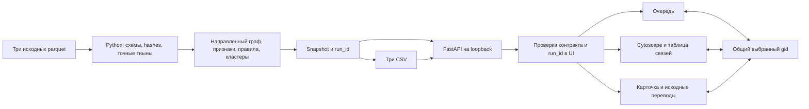

# Архитектура проверенного рабочего места

Зона B, интеграция с main/backend `8f770aa237a4263b60a5e347a6a763175d275d8a`.
Результат локального расчёта отображается через настоящий API. Синтетические ответы
подключаются только браузерными тестами; недоступный API не заменяется fixture.

## Граница ответственности

Python считает признаки, денежные агрегаты, роли, все кандидаты, caps, приоритет
и сообщества. UI показывает эти значения и условия из ответа. Он не делает собственную
AML-классификацию и не складывает страницу переводов вместо общего итога.
Для размещения вершин Cytoscape вычисляет только расстояния в показанном срезе;
логарифмическая толщина ребра — визуальный масштаб, исходная денежная строка сохранена.

`run.py` пересчитывает raw→результат и запускает FastAPI со статическим `web/dist`.
На runtime нужны Python 3.12 и установленные зависимости, Node нужен только для
пересборки/тестов. Шрифты системные, CDN, аналитики посещений и внешнего LLM нет.
API держит snapshot и байты CSV одного запуска; GET не инициирует вычисление.

## Контракт и точность

Gid, source и target всегда строки. Валидация диапазона int64 использует BigInt;
поиск, React keys, Cytoscape IDs и clipboard не проходят через Number/parseInt.
Денежные строки с двумя десятичными знаками форматируются без округления.
Соответствие правилу и приоритет проверки разделены и не обозначают вероятность вины.

Список endpoint и оболочек: [контракт](../contracts/README.md). Используются только:

| Экран | Запрос |
|---|---|
| Метаданные и ограничения | `GET /api/v1/meta` |
| Очередь и фильтры | `GET /api/v1/nodes` |
| Карточка | `GET /api/v1/nodes/{gid}` |
| Переводы all/in/out | `GET /api/v1/nodes/{gid}/transfers` |
| Обзор / кластер / ego | `GET /api/v1/graph` |
| Список и карточка кластера | `GET /api/v1/clusters`, `GET /api/v1/clusters/{id}` |
| CSV | `GET /api/v1/exports/{name}` |

`source_ref` и `source_row` ссылаются на физическую строку transactions.parquet,
с нулевой нумерацией; это не банковский ID. Совпадающие операции остаются разными
строками. Вход/выход переводов сверяются с направлением относительно выбранного gid.
Скачивание проверяет HTTP, CSV content type, attachment и X-Run-Id. Статус UI сообщает
о передаче файла браузеру; фактическое сохранение проверяется браузерным тестом.

## Согласованность и жизненный цикл

В `App` один selected gid для очереди, графа и карточки. Выбор вне текущей страницы
закрепляется отдельной строкой без выдуманного глобального ранга. Поиск по полному gid
сбрасывает фильтры и действует на весь набор. Неизвестный gid получает отдельную ошибку.

Каждый поток запросов имеет AbortController и счётчик актуальности. При выборе A→B
ответ A не применяется, даже если транспорт уже успел завершиться. При несовпадении
run_id текущая API-сессия блокируется, запросы отменяются, панели очищаются до обновления.
HTTP/JSON/сетевая ошибка показывается с действием повторного запроса.

Граф ограничен 250 узлами на запрос в UI; matched/shown counts и truncated выводятся явно.
Boundary и изоляты сохраняются. Стрелка source→target соответствует контракту, ego-окружение
может включать оба направления. Доступная таблица дублирует узлы и направления рёбер.
При unmount снимаются tap/listeners, отключается ResizeObserver, уничтожается Cytoscape.

## Компоновка B4

По запросу пользователя визуальная тема переработана: светлая оболочка, тёмное поле
графа, спокойная зелёная палитра, компактная очередь и отдельный блок основной гипотезы.
Это актуальное уточнение первоначальной полностью графитовой темы в 04_INTERFACE.md.
Все шрифты системные; SVG-иконки входят в сборку, новых зависимостей нет.

После выбора узла центральная область показывает граф на всю доступную высоту.
«Переводы» открываются вкладкой или нажатием суммы входа/выхода; «Вместе» остаётся
доступно на широком экране. Карточка содержит ссылки «Основания / Альтернатива /
Ограничения»: они прокручивают раздел и переводят в него клавиатурный фокус.
На 1024 px основные панели переключаются вкладками без сжатия трёх колонок.

Небольшое ego до 10 узлов использует концентрическую раскладку; более крупные срезы
и кластеры — ограниченный CoSE (400 итераций, детерминированные начальные координаты,
без анимации). Это геометрия представления, не пересчёт ролей или связей.
Для плотного обзора доступны масштабирование и таблица; полный gid виден в карточке.

## Проверка и границы

Unit проверяет parser, точность, scoped responses, race, snapshot и teardown.
Contract E2E проверяет реальные DOM/canvas/download в Chromium, подменяя HTTP только
в тестах. Integration E2E работает с настоящим API без route-подмен и сравнивает
скачанные CSV побайтно с API и файлами результата. Фактические команды, SHA и
результаты указаны в [журнале B](progress/B.md).

Подтверждены три desktop-размера; телефонный интерфейс и браузеры Safari/Firefox
не проходили приёмку. E1 removal доступен в backend, но UI-панель в этой версии
не подключена. E2 и аналитический агент не подключены.
Чат, симуляция инструментов и анимация агентной работы отсутствуют.

Объём проверки: 2 248 узлов, 3 119 связей, 4 840 переводов. Million-scale не заявляется.
Для него потребуются предрасчёт серверных срезов, уровни детализации и профилирование
памяти/центральностей; браузеру нельзя отправлять миллион подписанных элементов.
