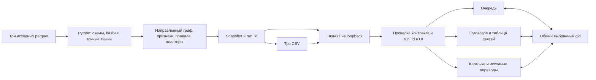

# Архитектура проверенного рабочего места

Зона B, интеграция с main/backend `57a9ccf1bcf315add266b177578d9984aacf1b13`.
Результат локального расчёта отображается через настоящий API. Синтетические ответы
подключаются только браузерными тестами; недоступный API не заменяется fixture.

## Граница ответственности

Python считает признаки, денежные агрегаты, роли, все кандидаты, caps, приоритет
и сообщества. UI показывает эти значения и условия из ответа. Он не делает собственную
AML-классификацию и не складывает страницу переводов вместо общего итога.
Для размещения вершин Cytoscape вычисляет только расстояния в показанном срезе;
логарифмическая толщина ребра — визуальный масштаб, исходная денежная строка сохранена.

`run.py` пересчитывает raw→результат и запускает FastAPI со статическим `web/dist`.
На runtime нужны Python 3.12 и установленные зависимости, Node нужен только для
пересборки/тестов. Шрифты системные; CDN и аналитики посещений нет. Основной режим не обращается к LLM.
Необязательная панель AI-аналитика A вызывает POST /api/v1/agent/query только по явному вопросу; сервер выбирает проверенные факты через инструменты модели. Default offline показывает отключённое состояние.
API держит snapshot и байты CSV одного запуска; GET не инициирует вычисление.

## Контракт и точность

Gid, source и target всегда строки. Валидация диапазона int64 использует BigInt;
поиск, React keys, Cytoscape IDs и clipboard не проходят через Number/parseInt.
Денежные строки с двумя десятичными знаками форматируются без округления.
Соответствие правилу и приоритет проверки разделены и не обозначают вероятность вины.

Список endpoint и оболочек: [контракт](../contracts/README.md). Используются только:

| Экран | Запрос |
|---|---|
| Метаданные и ограничения | `GET /api/v1/meta` |
| Очередь и фильтры | `GET /api/v1/nodes` |
| Карточка | `GET /api/v1/nodes/{gid}` |
| Переводы all/in/out | `GET /api/v1/nodes/{gid}/transfers` |
| Обзор / кластер / ego | `GET /api/v1/graph` |
| Список и карточка кластера | `GET /api/v1/clusters`, `GET /api/v1/clusters/{id}` |
| CSV | `GET /api/v1/exports/{name}` |

`source_ref` и `source_row` ссылаются на физическую строку transactions.parquet,
с нулевой нумерацией; это не банковский ID. Совпадающие операции остаются разными
строками. Вход/выход переводов сверяются с направлением относительно выбранного gid.
Скачивание проверяет HTTP, CSV content type, attachment и X-Run-Id. Статус UI сообщает
о передаче файла браузеру; фактическое сохранение проверяется браузерным тестом.

## Согласованность и жизненный цикл

В `App` один selected gid для очереди, графа и карточки. Выбор вне текущей страницы
закрепляется отдельной строкой без выдуманного глобального ранга. Поиск по полному gid
сбрасывает фильтры и действует на весь набор. Неизвестный gid получает отдельную ошибку.

Каждый поток запросов имеет AbortController и счётчик актуальности. При выборе A→B
ответ A не применяется, даже если транспорт уже успел завершиться. При несовпадении
run_id текущая API-сессия блокируется, запросы отменяются, панели очищаются до обновления.
HTTP/JSON/сетевая ошибка показывается с действием повторного запроса.

Граф ограничен 250 узлами на запрос в UI; matched/shown counts и truncated выводятся явно.
Boundary и изоляты сохраняются. Стрелка source→target соответствует контракту, ego-окружение
может включать оба направления. Доступная таблица дублирует узлы и направления рёбер.
При unmount снимаются tap/listeners, отключается ResizeObserver, уничтожается Cytoscape.

## Компоновка и темы B5

По запросу пользователя — плотное рабочее место с двумя темами и зелёной палитрой
по мотивам [Freedom Bank KZ](https://bankffin.kz/ru). Базовые цвета #4FB84E, #2A8640,
#055532 взяты из публичного стиля банка; текст и линии адаптированы для контраста.
Это самостоятельный интерфейс Neverlose. В B6 по прямому запросу пользователя добавлен
предоставленный им SVG Freedom; происхождение раскрыто в web/THIRD_PARTY.md.
Размещение логотипа не является заявлением о банковской аффилиации.
Все шрифты системные; SVG-иконки входят в сборку, новых зависимостей нет.

Переключатель солнце/луна в шапке имеет роль switch, доступен по Enter/Space.
Первое открытие использует системную тему; явный выбор сохраняется локально.
При недоступном localStorage тема меняется для текущего посещения. UI и Cytoscape
перекрашиваются вместе: граф обновляет только стили, сохраняя элементы, выделение,
масштаб и положение. Переключение не вызывает запросов API.

При выборе узла/кластера слева в шапке появляется стрелка «На главный экран».
Она открывает обзор кластеров и общую очередь, очищает карточку, поиск, фильтры,
шаги и fragment ссылки, отменяет связанные запросы и переводит фокус в поиск.
Поздний ответ закрытого узла не возвращает его карточку. Тема сохраняется.

После выбора узла центральная область показывает граф на всю доступную высоту.
«Переводы» открываются вкладкой или нажатием суммы входа/выхода; «Вместе» остаётся
доступно на широком экране. Карточка содержит ссылки «Основания / Альтернатива /
Ограничения»: они прокручивают раздел и переводят в него клавиатурный фокус.
На 1024 px основные панели переключаются вкладками без сжатия трёх колонок.

Небольшое ego до 10 узлов использует концентрическую раскладку; более крупные срезы
и кластеры — ограниченный CoSE (700 итераций, детерминированные начальные координаты,
без анимации). Это геометрия представления, не пересчёт ролей или связей.
Для плотного обзора доступны масштабирование и таблица; полный gid виден в карточке.

## Вход и читаемость графа B6

По одобренному пользователем макету при первом открытии вкладки показан короткий
стартовый экран Freedom / Neverlose. SVG включён локально, шрифты системные,
внешних загрузок нет. Появление знаков занимает 800 мс; кнопка доступна сразу.
При входе экран затухает за 160 мс, рабочее место появляется за 240 мс.
Это переход интерфейса, не индикатор расчёта. При prefers-reduced-motion анимация
и задержка пропускаются. API загружается независимо, ошибки сохраняют реальные
состояния. Вход запоминается на сессию вкладки; отказ storage не блокирует кнопку.
Нажатие названия Neverlose возвращает стартовый экран с сохранением контекста.

В общем обзоре скрыта пустая правая карточка, граф использует освободившуюся ширину.
По умолчанию кластеры размещены сеткой, без наложения блоков. Геометрический порядок
учитывает степень узла и cluster_id; это не новый рейтинг риска. Первоначально
подсвечены прямые связи первого кластера из ответа API — выбор виден в селекторе
и пояснении. «Все связи» снимает подсветку. Прочие элементы не удаляются; подписи
сохраняют контраст. Свободная раскладка «Сеть» доступна в том же селекторе; изоляты
собраны ниже связной части. Состав данных, направления и counts не меняются.

Масштабирование кнопками привязано к центру видимой области, текущий процент указан.
При переключении таблицы, темы и развороте камера сохраняется. «Вместить» явно
пересчитывает охват. Разворот скрывает шапку и боковые панели, Escape возвращает
фокус на кнопку. Таблица разделена на «Узлы / Кластеры» и «Связи», чтобы не прокручивать
весь список узлов до направлений. Hover раскрывает полный gid либо направление,
сумму и число переводов; клавиатурная альтернатива — таблица.

Подписи кластеров подстраиваются к масштабу в разумном диапазоне. При сильном
отдалении автоподписи скрываются; режим «Все» и наведение возвращают их.
Для узлов пояснены цвета ролей, в обзоре seed/boundary означают наличие таких
узлов внутри кластера. Cytoscape и ResizeObserver очищаются при выходе в заставку;
после скрытого монтажа на узком экране восстанавливаются подсветка и подписи.

## Проверка и границы

Аудит B7 добавил проверку единственного заголовка Host для всех маршрутов: разрешены
localhost, 127.0.0.1 и [::1] с необязательным портом. Чужой домен, userinfo или
повторный Host получают 403 HOST_DENIED. Это дополнительная защита локального
сервера от DNS rebinding, а не система аутентификации для публичного deployment.
verify_outputs теперь проверяет вложенные метаданные/manifest и статистику кластеров
(роли, boundary, направленные входы/выходы) по исходным данным даже после пересчёта
хешей файлов. Алгоритм, контракт, результаты классификации и CSV не изменены.

AI-панель отменяет запрос при смене фактически переданного контекста или run_id.
Если «Учитывать выбранный узел» выключено, выбор A→B не сбрасывает общий ответ;
примеры вопросов тоже соответствуют общему контексту. При входе фокус поиска
устанавливается после React commit через useLayoutEffect, а не в раннем кадре.

Unit проверяет parser, точность, scoped responses, race, snapshot и teardown.
Contract E2E проверяет реальные DOM/canvas/download в Chromium, подменяя HTTP только
в тестах. Integration E2E работает с настоящим API без route-подмен и сравнивает
скачанные CSV побайтно с API и файлами результата. Фактические команды, SHA и
результаты указаны в [журнале B](progress/B.md).

Подтверждены три desktop-размера; телефонный интерфейс и браузеры Safari/Firefox
не проходили приёмку. E1 removal доступен в backend, но UI-панель в этой версии
не подключена. E2 отсутствует. Агент реализован A через API/CLI и отдельный web/src/agent; фактические инструменты показываются после ответа сервера. AI-кнопка подключается в App; сохраняется легенда B в Network, а web/src/analysis/role-legend.css согласует точный цвет маркера транзита с рендерером. Симуляция инструментов не используется.

Объём проверки: 2 248 узлов, 3 119 связей, 4 840 переводов. Million-scale не заявляется.
Для него потребуются предрасчёт серверных срезов, уровни детализации и профилирование
памяти/центральностей; браузеру нельзя отправлять миллион подписанных элементов.
