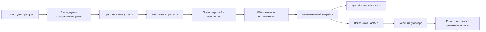

# Архитектура, стек и контракт между участниками

Версия контракта: `1`. Мейрам (A) владеет схемой. После первого согласования B не меняет поля сам; несовместимое изменение требует синхронизации обоих, обновления fixture и проверки UI. Все команды и интерфейсы ниже должны быть реализованы во время разработки; сейчас они описывают целевое состояние.

## 1. Стек

| Слой | Выбор | Причина |
|---|---|---|
| Runtime вычислений | Python 3.12 | Официальный starter, простой локальный запуск |
| Таблицы | pandas, NumPy, PyArrow | Непосредственная работа с parquet и агрегатами |
| Граф | NetworkX + SciPy | Размер 2 248 узлов подходит, прозрачные алгоритмы; SciPy нужен PageRank |
| API и локальный сервер | FastAPI, Pydantic 2, Uvicorn | Типизированный API и выдача собранного интерфейса |
| Интерфейс | React, TypeScript, Vite | Раздельная работа B, быстрая сборка статических ресурсов |
| Граф UI | Cytoscape.js | Направления, выбор узлов, стили, ограниченные подграфы |
| Стили | CSS variables и обычный CSS | Меньше зависимостей и изменений toolchain; точный визуальный контроль |
| Иконки | lucide-react либо небольшой локальный SVG-набор | Единая толщина и понятные действия; раскрыть происхождение |
| Тесты | pytest + httpx; Vitest; Playwright для 3–5 сквозных сценариев | Проверка расчёта, контракта и настоящего поведения браузера |
| Хранение | Неизменяемые parquet, snapshot JSON, CSV | БД не нужна для одной пакетной выгрузки |

React major фиксируется при создании web и не обновляется в течение хакатона. Предлагается React 19 / TypeScript 5 при совместимой установке. Vite и остальные frontend-пакеты зафиксировать `package-lock.json` после успешного build. Для Vite выбрать Node **22.12+** совместимой ветки 22; [официальные требования](https://vite.dev/guide/) указывают минимум Node 20.19+ или 22.12+. Не переносить `latest` в финальный README как способ воспроизведения.

На исследовательской машине проверено чтение данных и запуск оригинального starter с Python 3.12.14, pandas 2.2.3, NumPy 2.3.5, NetworkX 3.7, PyArrow 25.0.1, SciPy 1.18.1. Это **не подтверждение совместимости всего будущего приложения**. A закрепляет точные совместимые версии в `requirements.lock` после установки и `pip check`; B делает `npm ci` и build из lock на втором ноутбуке. Не обновлять зависимости после release candidate без причины.

## 2. Поток данных



Один расчёт при запуске; GET-запросы не запускают весь pipeline. Snapshot содержит version, hashes, config, признаки и готовые объяснения. UI отображает эти данные. Повторный расчёт — CLI/перезапуск, без конкурентных фоновых jobs в MVP. Ресурсы web/dist обслуживаются тем же процессом; API-роуты регистрируются до catch-all UI. FastAPI поддерживает выдачу [статических файлов](https://fastapi.tiangolo.com/tutorial/static-files/).

## 3. Целевая структура файлов и владельцы

```text
README.md                         A — реальный запуск и результаты
AGENTS.md / CLAUDE.md              A — общий контекст AI
requirements.lock                 A — точные Python зависимости
requirements-dev.lock             A — pytest/httpx и проверки
run.py                            A — проверка окружения, pipeline, serve
data/*.parquet                    A — оригиналы без изменений
data/README.md                    A — оригинальный README данных
starter/*                         A — оригинальный код организатора
app/__init__.py                    A
app/loader.py                     A — чтение, валидация, типы
app/features.py                   A — граф и признаки
app/clusters.py                   A — Louvain и статистика
app/roles.py                      A — правила, кандидаты, caps
app/ranking.py                    A — вклады в приоритет и порядок
app/explain.py                    A — evidence, альтернативы, запросы
app/pipeline.py                   A — orchestration и атомарный snapshot
app/schemas.py                    A — Pydantic контракт
app/api.py                        A — GET API и локальный serve
app/experiments.py                A — только если E1 допущен
config/rules.json                 A — все пороги, веса, версии
contracts/v1.example.json         A+B — synthetic fixture, не результат данных
tests/conftest.py                 A — synthetic fixtures
tests/test_data.py                A
tests/test_roles.py               A
tests/test_exports.py             A
tests/test_api.py                 A
tests/test_experiments.py         A — только E1
web/package.json / package-lock.json B
web/src/domain.ts                 B — типы, зеркалирующие контракт
web/src/api.ts                    B — запросы, отмена, обработка ошибок
web/src/App.tsx                   B — компоновка и общий state
web/src/components/Queue.tsx      B — приоритеты и поиск
web/src/components/Network.tsx    B — граф, teardown, выбор
web/src/components/NodePanel.tsx  B — карточка и гипотезы
web/src/components/Transfers.tsx  B — исходные переводы
web/src/components/ClusterPanel.tsx B
web/src/styles.css               B
web/src/*.test.ts                 B — идентификаторы/состояния/контракт
web/e2e/workspace.spec.ts         B
web/dist/*                       B — финальная локальная сборка
results/nodes_roles.csv           A — генерируемый итог
results/clusters.csv              A
results/top_nodes.csv             A
results/snapshot.json             A
results/manifest.json             A
docs/hackalem/*                   текущий пакет планирования
docs/progress/A.md / B.md          каждый свой журнал
docs/progress/hour-1.md…hour-5.md   A — сводка реального прогресса
docs/validation.md                A — результаты команд
docs/demo.md                      B — фактический демо-сценарий
docs/architecture.md              B — схема и краткое объяснение
THIRD_PARTY.md                    A с вкладом B
```

Нет общего файла, который два участника регулярно редактируют одновременно. A — интегратор main. B присылает коммиты ветки `codex/workspace-ui`; A работает в `codex/analysis-core`. Обе ветки только в официальном remote, без личного fork. Merge сохраняет историю; не squash всей пятичасовой работы в один финальный коммит, не force-push.

## 4. CLI и воспроизводимость

После документированной однократной установки зависимостей целевая команда жюри:

```bash
python run.py
```

Поведение: проверить файлы и зависимости → пересчитать из raw → атомарно записать results → поднять localhost:8000 → напечатать URL. `web/dist` уже собран и включён в финальный коммит. Node нужен для разработки и пересборки, а не для каждого просмотра жюри.

Дополнительные режимы:

```bash
python run.py --pipeline-only --data data --out results
python run.py --verify-only --data data --out results
python run.py --host 127.0.0.1 --port 8001
python -m pytest tests -q
```

`--verify-only` проверяет raw↔результат, hash/config и схемы; не притворяется пересчётом. Замер <300 секунд относится к `--pipeline-only`, от чтения raw до завершения CSV, без установки пакетов. Отдельно записать время установки/первого старта. Python bootstrap не должен самовольно ставить пакеты или менять системное окружение: при нехватке зависимостей выводит точную команду для `.venv`.

Предлагаемая установка macOS/Linux после появления lock:

```bash
python3.12 -m venv .venv
source .venv/bin/activate
python -m pip install -r requirements.lock
python run.py
```

Windows PowerShell: `py -3.12 -m venv .venv`, затем запуск `.venv\Scripts\python.exe -m pip install -r requirements.lock` и `.venv\Scripts\python.exe run.py`; активация не обязательна. Если Windows не проверяли — явно написать это. Для проверки исходников UI: `cd web`, `npm ci`, `npm run build`. Проверить выдачу web/dist на чистом clone.

Установка зависимостей и offline-runtime — разные проверки. Без сети после установки работает весь основной сценарий. Если организатор требует установку на пустой машине полностью без сети, нужны заранее проверенные wheels под ОС/архитектуру жюри; универсальный wheelhouse для неизвестной ОС не обещать. `.venv` участника не является переносимым решением.

## 5. Общие правила API

- Base URL `/api/v1`, версия не меняется без синхронизации.
- Все gid/src/dst — decimal string; проверка `^[0-9]{1,19}$` и диапазон int64 на backend. Полное равенство, без округления.
- Денежные поля `*_kzt` в JSON — строки с двумя десятичными знаками. Числа только для score, counts, durations, координат. В диаграмме можно перевести локальную копию суммы в number для масштаба, не для агрегации и не для gid.
- `null` вместо NaN/Infinity/отсутствующего измерения. Ноль означает измеренный ноль.
- Каждый успешный аналитический ответ содержит `run_id`; клиент не смешивает данные разных run_id.
- Пагинация: offset≥0, limit 1…200; сортировки только из whitelist. Не принимать произвольные выражения или пути файлов.
- Сервер слушает loopback. Нет production-авторизации и обещания готовности к размещению в банковской сети.

### Конечные точки

| Метод и путь | Вход | Выход |
|---|---|---|
| GET `/health` | — | status=ready, schema_version, run_id |
| GET `/api/v1/meta` | — | dataset/analysis meta, counts, period, limitations, config_version |
| GET `/api/v1/nodes` | role?, cluster_id?, boundary?, is_seed?, offset=0, limit=50 | items NodeSummary[], total, offset, limit |
| GET `/api/v1/nodes/{gid}` | exact gid | NodeDetail |
| GET `/api/v1/nodes/{gid}/transfers` | direction=all/in/out, offset=0, limit=50 | items Transfer[], total, суммы всей выборки direction |
| GET `/api/v1/graph` | mode=overview/ego/cluster, gid?, cluster_id?, hops=1, limit=250 | nodes GraphNode[], edges GraphEdge[], scope, counts, truncated |
| GET `/api/v1/clusters` | — | ClusterSummary[] |
| GET `/api/v1/clusters/{id}` | integer id | ClusterDetail |
| GET `/api/v1/exports/{name}` | whitelist трёх CSV | файл UTF-8, attachment |
| GET `/api/v1/nodes/{gid}/brief` | exact gid | Markdown-справка по узлу; при нехватке времени кнопку не показывать |
| POST `/api/v1/experiments/removal` | gids:string[], 1…3 | before/after, affected_pairs; только расширение E1 |

`/api/v1/nodes` всегда сортируется по priority desc, gid asc; UI-фильтры меняют состав списка, а не глобальные роли, кластеры и score. Поиск полного gid вызывает отдельный endpoint и при необходимости сбрасывает фильтры с уведомлением.

### Основные типы

```ts
type Gid = string;
type Kzt = string;
type Role = 'consolidator'|'transit'|'distributor'|'terminal'|'coordinator'|'peripheral';
type Flag = 'boundary'|'isolated'|'seed_inflow_incomplete'|'out_exceeds_in'|'low_observation';
type RuleCheck = { key:string; actual:number|null; operator:string; threshold:number|null; passed:boolean; text:string };
type Contribution = { key:string; label:string; raw:number; normalized:number; weight:number; contribution:number };
type Candidate = { role:Role; eligible:boolean; raw_score:number; capped_score:number; checks:RuleCheck[] };
type NodeSummary = { gid:Gid; role:Role; role_score:number; cluster_id:number; priority_score:number; evidence:string; depth:number; is_seed:boolean; flags:Flag[] };
type NodeDetail = NodeSummary & {
  run_id:string; in_degree:number; out_degree:number;
  in_kzt:Kzt; out_kzt:Kzt; in_tx:number; out_tx:number;
  observed_ratio:number|null; seed_reach_count:number;
  pagerank:number; betweenness:number; participation:number;
  role_rule_id:string; candidates:Candidate[];
  priority_contributions:Contribution[];
  limitations:string[]; next_data_requests:string[];
};
type Transfer = { source_ref:string; source_row:number; src:Gid; dst:Gid; date:string; sum_kzt:Kzt };
type ClusterSummary = { cluster_id:number; n_nodes:number; n_seed:number; sum_kzt_internal:Kzt; top_gids:Gid[]; hypothesis:string };
type ClusterDetail = ClusterSummary & { run_id:string; role_counts:Record<Role,number>; boundary_count:number; cross_in_kzt:Kzt; cross_out_kzt:Kzt };
type GraphNode = { id:string; kind:'node'|'cluster'; gid:Gid|null; cluster_id:number; label:string; role:Role|null; priority_score:number|null; boundary:boolean; is_seed:boolean; n_nodes:number };
type GraphEdge = { id:string; source:string; target:string; sum_kzt:Kzt; n_tx:number };
```

`GraphNode.id` для клиента = `n:<gid>`, для обзорного кластера = `c:<cluster_id>`. `source/target` содержат именно эти ID. `ClusterDetail` дополняется списком узлов через `/nodes?cluster_id=...`, не бесконечным вложенным JSON. Период date в ISO `YYYY-MM-DD`, без выдуманного времени и timezone.

`source_row` — 0-based физическая позиция в оригинальном transactions.parquet; `source_ref = tx:<первые 12 символов SHA-256>:<source_row>`. Это локальный идентификатор для воспроизводимости, не банковский ID транзакции. UI явно так его называет.

### Graph response

```json
{
  "run_id": "example-synthetic-contract-only",
  "scope": {"mode":"ego","gid":"100000000011452100","hops":1},
  "nodes": [],
  "edges": [],
  "counts": {"matched_nodes":0,"shown_nodes":0,"matched_edges":0,"shown_edges":0},
  "truncated": false
}
```

Это только форма ответа, не валидный ответ для реального существующего узла. В fixture B использует отдельные вымышленные gid, помечает весь экран «Тестовый контракт», затем заменяет fixture настоящим API. Нельзя оставлять fixture в production fallback.

Ego: соседи по обоим направлениям, hops=1 или 2; исходные направления сохраняются. Центральный узел всегда включён. При превышении limit сначала root, далее расстояние от root asc, priority desc, gid asc. Показывать induced edges выбранных узлов и честные matched/shown counts; UI не сообщает об отсутствии связей, если они просто скрыты лимитом. Overview агрегирует кластеры; суммы межкластерных направлений считаются отдельно, внутренние рёбра остаются в статистике кластера.

### Ошибки

Формат: `{"error":{"code":"NODE_NOT_FOUND","message":"Узел не найден","details":{}},"run_id":"..."}`. 404 — неизвестный gid/cluster; 422 — плохой параметр; 503 — snapshot не готов; 500 — внутренняя ошибка с безопасным сообщением. Некорректный raw-input завершает CLI ненулевым кодом до запуска сервера. Серверный traceback в локальном логе, UI не получает содержимое окружения и секреты. Для штатной ошибки нужен текст и действие «Повторить»/«Сбросить фильтры», не бесконечный spinner.

## 6. Выходные CSV — неизменяемый контракт жюри

UTF-8, запятая, header, стандартное CSV quoting, без DataFrame index. Десятичная точка; денежные суммы два знака. Первые обязательные колонки в следующем порядке; дополнительные колонки можно добавить справа, но MVP обходится базовой схемой.

```text
nodes_roles.csv: gid,role,role_score,cluster_id,priority_score,evidence
clusters.csv: cluster_id,n_nodes,n_seed,sum_kzt_internal,top_gids,hypothesis
top_nodes.csv: rank,gid,role,priority_score,why
```

nodes_roles: ровно одна строка на каждую исходную вершину. cluster_id положительный; role из шести; оба score конечные в [0,1]; evidence 1…200 символов. clusters: сумма n_nodes=N, сумма n_seed=81 на официальном наборе, все top_gids принадлежат своему кластеру. top_nodes: 50 строк на полном наборе, rank=1…50, unique gid; score/role совпадают с nodes_roles. Изоляты сохраняются в nodes_roles и clusters, но их не надо искусственно продвигать в top.

Для заголовков и строк применять csv.writer / pandas.to_csv, а не ручную конкатенацию. Защитить потенциальные свободные текстовые поля от CSV formula injection, если позже появится пользовательский ввод; текущие текстовые поля генерируются собственными шаблонами и не являются входящими банковскими комментариями.

## 7. Snapshot, manifest и атомарность

`run_id` = SHA-256 канонического JSON из трёх source hashes, config JSON, algorithm_version и точных версий вычислительных библиотек. Версии вычислительных библиотек также перечислить в metadata для диагностики воспроизводимости. Timestamp отдельно. Все результаты пишутся сначала во временный каталог в results parent, проходят валидатор, затем становятся активным snapshot. При ошибке старый успешный результат не выдаётся за новый: API/meta показывает только явно загруженный валидный run.

Manifest: input hashes/rows; config hash; algorithm_version; package versions; counts; duration_seconds; limitations; output hashes. Сам manifest не входит в свой hash. Проверка повторного запуска сравнивает три CSV и детерминированную часть snapshot, исключая duration и timestamp.

## 8. Взаимодействие без конфликтов

A к T+20 отдаёт B контракт и synthetic fixture; к T+65 — первые настоящие CSV/snapshot; к T+100 — API. B с T+20 рисует по fixture, к T+100 соединяет UI с API. При задержке A B не изобретает формулы на клиенте; продолжает состояния, клавиатуру, граф и тесты. A не меняет CSS/React во время работы B. Общие изменения согласуются коротким сообщением: поле → причина → совместимость → commit.

Через каждые 30–40 минут обе ветки push в официальный репозиторий. A интегрирует после локальных проверок, перед каждым отчётным часом фиксирует сводку. Git не заменяет подачу решения на платформе — это отдельный пункт сдачи.
